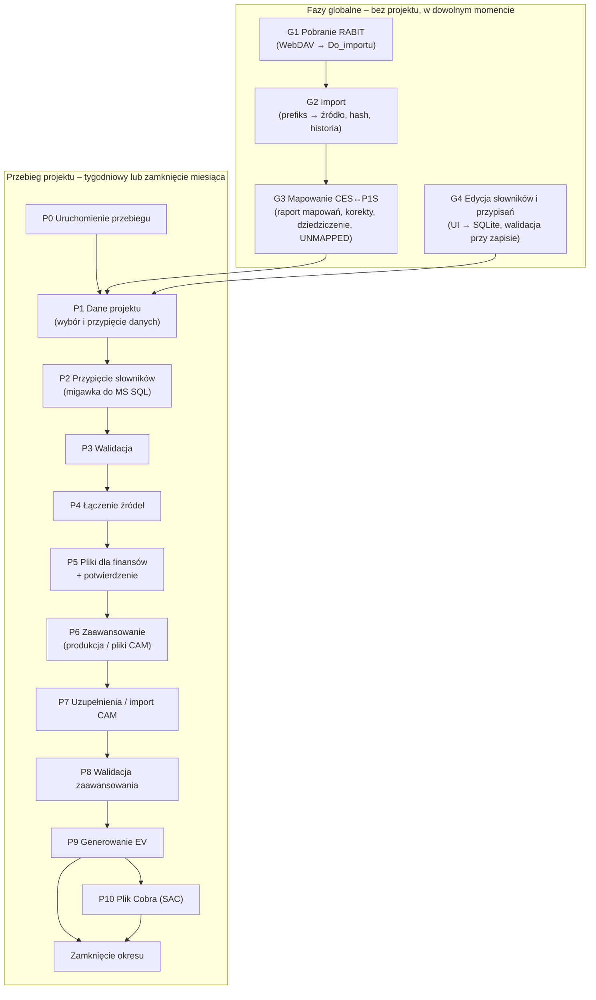

# PZL-EV – Fazy pipeline (koncepcja)

Wersja: 0.5 (koncepcja do dyskusji; 0.5: **jedyne miejsce opisu przepływu i etapów** – przeniesione z
`docs/funkcjonalnosc.md` (F04–F18, statusy etapu), `docs/architektura.md` (5.2–5.7, 6.2, proces z 7.3–7.4)
i `readme.md` (przebieg projektu); 0.3: słowniki w bazie z interfejsem – M13/M15, D26–D27;
0.4: „projekt” zamiast „zakresu” – M22, mapowanie z raportu mapowań – M16–M18, kompletność źródeł projektów usunięta – M21, Cost Category – M26)
Powiązane: `docs/architektura.md`, `docs/funkcjonalnosc.md`, `docs/mvp-etap1.md` (faza G1–G2 – działa).

> **Ten dokument jest jedynym opisem przepływu** (faz globalnych i etapów przebiegu): cel, wejście, bramki,
> działanie w aplikacji, kontrole, efekt, statusy, współbieżność. Inne dokumenty go nie powtarzają. Numery
> funkcji F04–F18 ze specyfikacji są podane przy fazach.

---

## 1. Zasady wspólne dla wszystkich faz („kontrakt klocka”)

Każda faza jest osobnym klockiem o tym samym kształcie:

| Element | Znaczenie |
|---|---|
| **Wejście** | czyta **wyłącznie** dane utrwalone przez wcześniejsze fazy (tabele w bazie, zarejestrowane pliki, przypięty stan słowników – migawka w MS SQL, D27) – nigdy „z pamięci” poprzedniego kroku |
| **Bramka wejścia** | warunki, bez których faza nie ruszy (np. poprzednia faza zakończona, słowniki projektu kompletne) |
| **Przetwarzanie** | logika biznesowa w bazie (procedury SQL); Python orkiestruje, czyta i zapisuje pliki |
| **Wyjście** | tabele w bazie + ewentualne pliki; każdy rekord ma identyfikator pochodzenia (import, przebieg, stan słowników) |
| **Bramka wyjścia** | kontrole, które muszą przejść, żeby następna faza mogła ruszyć |
| **Zapis stanu** | status fazy, kto, kiedy, **identyfikatory wejść** (hashe plików, znacznik stanu słowników, rewizje) – w `meta.EtapPrzebiegu` i dzienniku |
| **Idempotencja** | ponowne uruchomienie z tymi samymi wejściami daje ten sam wynik i nie dubluje danych |
| **Unieważnienie** | zmiana wejść fazy oznacza ją i wszystkie późniejsze jako **nieaktualne** |

Komunikacja między klockami odbywa się **przez bazę**: faza N zapisuje wynik i status, faza N+1 sprawdza
status i identyfikatory wejść. Dzięki temu fazy mogą być wykonywane przez różne osoby, w różne dni,
z różnych komputerów.

### 1.1 Statusy etapu przebiegu

| Status | Znaczenie | Przejścia |
|---|---|---|
| Oczekuje | poprzednie etapy niezakończone | → Do wykonania |
| Do wykonania | można uruchomić akcję etapu | → W toku |
| W toku | operacja trwa (blokada przebiegu) | → Zakończony / Wymaga akcji / Błąd |
| Wymaga akcji | potrzebna decyzja lub dane (potwierdzenie, pliki CAM, uzupełnienia, nowe elementy) | → Zakończony / Do wykonania |
| Błąd | błąd blokujący (np. walidacja) | → Do wykonania (po poprawie) / Zakończony (decyzja) |
| Zakończony | bramka spełniona | → Nieaktualny (gdy zmienią się wejścia) |
| Nieaktualny | wynik oparty na nieaktualnych danych | → Do wykonania |

- Zakończenie etapu udostępnia następny; stan przebiegu wynika ze stanów etapów – pierwszy niezakończony
  etap wyznacza „co dalej”.
- Ponowne wykonanie etapu (albo zmiana jego wejść) oznacza etapy późniejsze jako **Nieaktualne**.
- Każda zmiana statusu trafia do dziennika (kto, kiedy, co).

### 1.2 Współbieżność

- Jeden przebieg na projekt i tydzień (lub zamknięcie okresu) – wymuszane w bazie.
- Operacja w toku (np. import) zakłada krótką blokadę przebiegu (`sp_getapplock`), żeby dwie osoby
  nie wykonały tej samej operacji jednocześnie (druga osoba widzi komunikat).
- Zapis w bazie słowników (SQLite na dysku sieciowym) – krótkie transakcje, jeden zapis naraz (D26).
- Import pliku jest idempotentny: ten sam hash nie tworzy nowej wersji ani duplikatu danych.

---

## 2. Mapa faz

| Faza | Zasięg | Kto | Kiedy | Stan |
|---|---|---|---|---|
| G1 Pobranie RABIT (F05a) | globalna | dowolna osoba z finansów / harmonogram | co najmniej tak często jak RABIT | **działa** |
| G2 Import (F05a) | globalna | j.w. | po G1 (razem) | **działa** |
| G3 Mapowanie CES↔P1S (F21–F24) | globalna | automatycznie po G2, decyzje – finanse (UI) | po G2 | koncepcja |
| G4 Edycja słowników i przypisań (F03, F25) | globalna | dowolna osoba z finansów (UI) | w dowolnym momencie | koncepcja |
| P0–P10 | projekt | osoba prowadząca projekt | tydzień / zamknięcie | prototyp |

Etapy przebiegu (numer etapu na ekranie Przebieg = numer fazy):

| Faza / etap | Tydzień | Zamknięcie miesiąca | Bramka wyjścia | Funkcja |
|---|---|---|---|---|
| P0 | Uruchomienie przebiegu | Uruchomienie przebiegu | kontrole przed startem | F04 |
| P1 | Dane projektu | Dane projektu | wybór danych projektu z przypiętych plików; zgodny okres | F05 |
| P2 | Przypięcie słowników | Przypięcie słowników | przypięty stan, migawka w MS SQL (D27) | F06 |
| P3 | Walidacja | Walidacja | brak błędów blokujących | F07 |
| P4 | Łączenie źródeł | Łączenie źródeł | pokrycie; nowe elementy przypisane lub (tydzień) świadomie pominięte | F08 |
| P5 | Pliki dla finansów | Pliki dla finansów | potwierdzenie w aplikacji (D10) | F09 |
| P6 | Zaawansowanie z produkcji | Pliki dla CAM | pobrane / wygenerowane | F10 / F12 |
| P7 | Uzupełnienie braków | Import plików CAM | braki uzupełnione / pliki wszystkich CAM zaimportowane | F11 / F12 |
| P8 | Walidacja zaawansowania | Walidacja zaawansowania | zamknięcie: 100% wartości od CAM | F13 |
| P9 | Generowanie EV | Generowanie EV | rewizja zapisana z wersjami wejść | F14 |
| P10 | Plik dla Cobra (SAC) | Plik dla Cobra (SAC) | – | F15 |
| – | – | Zamknięcie okresu | zatwierdzenie, zamrożenie | F18 |

---

## 3. Fazy globalne

Kontekst: **RABIT** automatycznie (także pod nieobecność pracownika) zrzuca wyniki różnych raportów SAP
na SharePoint i przy każdym uruchomieniu **nadpisuje ten sam plik**. Na etapie pobierania nie wiadomo,
czego dotyczy plik – o tym decyduje dopiero G2 na podstawie definicji plików (do ustalenia później).

### G1. Pobranie plików RABIT *(F05a; działa – do uzupełnienia o wersjonowanie)*

| | |
|---|---|
| **Cel** | Nie zgubić żadnej wersji raportu zrzuconej przez RABIT i mieć ją na dysku firmy. |
| **Wejście** | Folder RABIT na SharePoint czytany przez **WebDAV** (usługa WebClient Windows, konto użytkownika; D23; lokalizacja – `docs/architektura.md`, rozdz. 7.3). |
| **Jak pracuje** | Porównuje pliki źródłowe z ostatnio pobranymi (rozmiar, data modyfikacji); kopiuje tylko nowe i zmienione. Nie interpretuje treści. |
| **Nazwy plików** | Proste, bez projektu, dat i wersji (np. `ACTUALS_PAF_01.xlsx`); o źródle decyduje prefiks. G1 zachowuje nazwę z RABIT. |
| **Ryzyko** | RABIT nadpisuje plik – jeśli między dwoma uruchomieniami RABIT nie było pobrania i importu, poprzednia wersja przepada. Dlatego G1 i G2 uruchamia się razem i co najmniej tak często jak RABIT (np. harmonogram zadań Windows); historia wersji jest w bazie (hash), nie w nazwach plików. |
| **Kontrole** | Dostępność WebDAV; limit usługi WebClient – domyślnie ok. 50 MB na plik (`FileSizeLimitInBytes`, zmienia administrator); większy plik pobiera się ręcznie w przeglądarce do `Do_importu` i import traktuje go tak samo (D22). |
| **Efekt** | Aktualna kopia plików RABIT w `00_Global\RABIT\Do_importu`. |
| **Przekazanie** | Folder `Do_importu` jest wejściem G2. |

### G2. Import *(F05a; działa: rozpoznanie po prefiksie, hash, historia; tabele typowane – po zdefiniowaniu raportów)*

| | |
|---|---|
| **Cel** | Każdy **rozpoznany** plik załadować do bazy jako źródło z markerem pochodzenia – tak, żeby dało się odtworzyć dowolny wcześniejszy stan i porównać dwa stany. |
| **Zasada** | Import jest **globalny** – obejmuje wszystkie pliki, projekt nie jest znany (D21). **Plik mówi, czym jest** (prefiks nazwy → źródło, D24). Zakres danych projektu wynika z jego węzłów w drzewie P1S; jedna paczka RABIT może obejmować wiele projektów, np. całe PWC (M21). |
| **Wejście** | Pliki w `Do_importu`; konfiguracja prefiksów (Prefiks → KodZrodla) w bazie słowników – M15 (w MVP przejściowo `konfiguracja/zrodla_rabit.csv`). |
| **Jak pracuje** | 1) Prefiks nazwy → źródło (najdłuższy pasujący prefiks, bez rozróżniania wielkości liter). 2) Hash SHA-256: ten sam fizyczny plik = duplikat. 3) Nowa treść → Landing Zone + wiersze w bazie. Każdy rozpoznany plik osobno – także `ACTUALS_PAF_01/_02/_03` o różnych kolumnach. |
| **Marker pochodzenia** | Każdy plik (i przez niego każdy wiersz): `IdImportu` (kto, kiedy), `Sha256`, **kod źródła**, **data raportu** (data modyfikacji w RABIT). Jedna wersja pliku = jeden snapshot. |
| **Archiwalność** | Tylko dopisywanie. Każda nowa treść nadpisanego przez RABIT pliku to nowa wersja w historii; oryginał w Landing Zone. Widok „najnowszy stan” i porównanie wersji – na tej historii. |
| **W aplikacji** | Ekran **Import**: **Pobierz** (G1) + **Importuj** (G2); import może uruchomić każda osoba z finansów w dowolnym momencie, historia importów widoczna dla wszystkich. MVP: `python -m pzl_ev.etap1 pobierz` + `import` (`docs/mvp-etap1.md`). |
| **Decyzja dla pliku** | **zaimportowany** (nowy hash), **duplikat** (ten fizyczny plik był już zaimportowany), **pominięty** (te same metadane co przy poprzednim imporcie – bez kopiowania), **nierozpoznany** (brak prefiksu), **błąd**. |
| **Kontrole** | Brak prefiksu → „nierozpoznany” (nie importowany; po dopisaniu prefiksu zaimportuje się przy kolejnym uruchomieniu). Uszkodzony plik → „błąd” (reszta importuje się dalej). |
| **Efekt** | `meta.ImportBatch` (każde uruchomienie: kto, kiedy, liczniki), `meta.SourceFile` (hash, kod źródła, kolumny, **sygnatura kolumn** – zmiana układu raportu, liczba wierszy), `meta.SourceFileSeen` (decyzja dla każdego pliku w każdym imporcie), `stg.RawRow` / `stg.vRawRowZrodlo` (wiersze surowe z kodem źródła i importem). |
| **Później** | Tabele typowane per źródło (mapowanie kolumn), gdy będzie wiadomo, co zawierają raporty. |
| **Przekazanie** | Historia importów źródeł jest wejściem G3 (elementy WBS) i P1 (dane projektu – przebieg przypina wszystkie zaimportowane pliki, M21). |

### G3. Mapowanie CES ↔ P1S *(F21–F24; koncepcja – `docs/mapowanie-ces-p1s.md`, D25)*

| | |
|---|---|
| **Cel** | Wiedzieć o **każdym elemencie WBS CES** z danych, do którego elementu P1S (i przez to projektu) należy – i szybko wychwycić te bez decyzji. Część administracyjna, bez kosztów (M16). |
| **Wejście** | Raport mapowań SAP↔CES z `PZLPROD` (tylko odczyt, M16); elementy CES (`Project Definition`, `WBS Element`) z nowych snapshotów G2; drzewo P1S i kategoryzacja z `PZLPROD.LOG.WBS` (M20); korekty z bazy słowników (SQLite, M18). |
| **Jak pracuje** | Rozstrzyganie po `pspnr`: korekta elementu (`OVERRIDE`) → raport (`REPORT`) → WBS spoza raportu: cel projektu CES z korekty projektu albo z raportu (`INHERITED`) → `UNMAPPED` (M16–M18). |
| **Kontrole** | Co najwyżej jeden cel P1S na element CES (M3); zmiana względem raportu z uzasadnieniem; element bez celu → `UNMAPPED` (alert na pulpicie, z kosztem – liczony, ale poza EV, M9). `NO_P1S` odłożony (M14). |
| **Efekt** | Lista nowych elementów z wynikiem (`INHERITED`, `UNMAPPED`); dwa drzewa w strukturze kategoryzacji z węzłem „Nieprzypisane” (M19). Źródłem prawdy jest raport + korekty, nie rekordy pochodne. |
| **Przekazanie** | Korekty zapisywane w UI (ekran Mapowanie CES ↔ P1S). P1 i P4 korzystają ze stanu mapowania; przypinanie stanu raportu – O19; zamknięcie z kosztem `UNMAPPED` – pytanie P10. |

> *Wcześniej (zastąpione: M16–M18):* wejście – reguły mapowania z bazy słowników; rozstrzyganie – wyjątek
> WBS → reguła projektu (dziedziczenie) → automatyczna propozycja (kody / opisy, M12) → `UNMAPPED`.

### G4. Edycja słowników i przypisań *(F03, F25; koncepcja)*

| | |
|---|---|
| **Cel** | Utrzymywać słowniki globalne i słowniki projektów (stawki wydziałów, kalendarz okresów, kursy USD/PLN, stawki CAS, WP i CAM, harmonogram i budżet, Cost Category globalny i zmiany w projekcie (M26), korekty mapowania CES↔P1S (M18), **konfiguracja prefiksów RABIT** (~~i źródeł projektów~~ – usunięte, M21)). |
| **Wejście** | Zmiany wprowadzane w aplikacji (CRUD + drzewo) albo wczytane z Excela z tą samą walidacją i podglądem różnic (słowniki projektu, Cost Category – M24, M26). Źródłem prawdy jest baza (M13). |
| **Jak pracuje** | Interfejs (CRUD + drzewo) → walidacja przy zapisie (rozdz. 5 specyfikacji) → nowy wpis z historią SCD2 (`ValidFrom`/`ValidTo`, kto, kiedy, poprzednia i nowa wartość) → baza słowników SQLite (`00_Global\Baza\`), krótka transakcja. |
| **Kontrole** | Błąd blokujący nie pozwala zapisać; jednocześnie zapisuje jedna osoba (SQLite na dysku sieciowym). |
| **Efekt** | Nowy stan słowników z historią. |
| **Przekazanie** | Przebieg przypina stan w P2 i kopiuje migawkę do MS SQL (D27); aktywne przebiegi z wcześniejszym stanem dostają decyzję „kontynuuj / przelicz od P3” (rozdz. 4a). |

---

## 4. Fazy przebiegu projektu

**Przebieg** (`Run`) dotyczy jednego projektu i jednego okresu:

- **tygodniowy** – w dowolny dzień tygodnia w trakcie miesiąca (D7), EV wstępne (nieformalne),
- **zamknięcie miesiąca** – EV formalne, oparte wyłącznie na zaawansowaniu od CAM (D14), po zatwierdzeniu
  zamrażane.

Identyfikator: `R-<Projekt>-<RRRR-MM>-T<tydzień>` lub `R-<Projekt>-<RRRR-MM>-Z`. Przebieg jest trwałym
obiektem w bazie – może trwać dni (oczekiwanie na CAM); aplikację można zamknąć, a fazy mogą być wykonywane
w różne dni i przez różne osoby z finansów (D9). Każdy przebieg dotyczy jednego projektu, więc projekty
nie czekają na siebie (np. F-16 nie czeka na pliki Cobra projektów SAC). Faza P*n* = **etap *n*** przebiegu
na ekranie Przebieg (oś etapów, panel wybranego etapu, przypięte słowniki, dziennik).

### P0. Uruchomienie przebiegu *(F04)*

| | |
|---|---|
| **Cel** | Założyć przebieg projektu za okres i zapisać, na czym startuje. |
| **Jak pracuje** | Wybór rodzaju: **tygodniowy** (bieżący tydzień – w dowolny dzień tygodnia, D7) albo **zamknięcie miesiąca**. Podgląd stanu słowników, który zostanie przypięty (ostatnie zmiany: kto, kiedy). |
| **Bramka wejścia** | brak innego przebiegu tego projektu dla tego tygodnia / zamknięcia (**blokuje**); zgodna wersja aplikacji i schematu bazy (**blokuje**); słowniki projektu kompletne – WP, CAM, harmonogram i budżet, w CAS stawki CAS (**blokuje**); tydzień: świeżość danych produkcyjnych (data odświeżenia `vAHDD`); zamknięcie: informacja, jeśli okres jeszcze trwa. |
| **Efekt** | Przebieg `R-<Projekt>-<RRRR-MM>-T<tydzień>` / `R-<Projekt>-<RRRR-MM>-Z`, przypięcia i pierwsze zdarzenie w dzienniku. |
| **Przekazanie** | P1. |

### P1. Dane projektu *(etap 1, F05)*

| | |
|---|---|
| **Cel** | Wybrać z danych globalnych **tylko to, co należy do projektu i okresu**, i zamrozić ten wybór na czas przebiegu. |
| **Wejście** | Tabele raportów z G2 (najnowsze snapshoty); stan mapowania z G3; zakres P1S projektu (węzły drzewa – M23) i WP (baza słowników); kalendarz okresów. |
| **Bramka wejścia** | Import plików SAP (G1–G2) wykonany; aplikacja pokazuje datę ostatniego importu i pliki, które pojawiły się od poprzedniego przebiegu. |
| **Jak pracuje** | **Przypina wszystkie zaimportowane pliki** (lista hashy, M21) – analogicznie do przypinania stanu słowników – i wybiera z nich wiersze elementów projektu (elementy P1S z zakresu projektu – M23, elementy CES przypisane do nich w mapowaniu – G3) w okresie przebiegu (koszt okresu i narastająco). |
| **Kontrole** | Daty w okresie przebiegu; plik nie zmienił się od importu (hash); pliki „nierozpoznane” (ostrzeżenie); elementy `UNMAPPED` z G3 (ostrzeżenie; zamknięcie – blokada). |
| **Efekt** | Snapshot danych projektu `hist.DaneZakresu` (RunId, Sha256) + lista przypiętych plików. Wiersze bez przypisania do żadnego projektu są pokazywane w P4 jako nowe elementy. |
| **Przekazanie** | P2–P4 pracują wyłącznie na tym snapshocie. Nowy import w trakcie przebiegu → rozdz. 4a. |

### P2. Przypięcie słowników *(etap 2, F06)*

| | |
|---|---|
| **Cel** | Zamrozić stan słowników (globalnych i projektu – w tym oba słowniki Cost Category, M26), na którym liczy przebieg. Stan raportu mapowań – O19. |
| **Wejście** | Baza słowników (SQLite) – stan po edycjach z G4. Słowniki nie są importowane z plików. |
| **Jak pracuje** | Tabela słowników przebiegu: nazwa, zasięg (globalny / projekt), liczba wierszy, ostatnia zmiana (kto, kiedy). **Przypnij** zapisuje znacznik stanu w przebiegu i **kopiuje migawkę** słowników projektu i globalnych do MS SQL, schemat `dict` (D27) – procedury w MS SQL nie czytają SQLite. |
| **Efekt** | `dict.StanSlownikow` (RunId, znacznik) + tabele `dict.*` z migawką. |
| **Przekazanie** | P3–P9 czytają wyłącznie migawkę. Zmiana słowników później → rozdz. 4a. |

### P3. Walidacja *(etap 3, F07)*

| | |
|---|---|
| **Cel** | Nie dopuścić niespójnych danych i słowników do obliczeń. |
| **Wejście** | Migawka słowników z P2; snapshot danych z P1. |
| **Jak pracuje** | Poprawność samych słowników zapewnia walidacja przy zapisie (G4). Tu: walidacja plików SAP (`docs/funkcjonalnosc.md`, rozdz. 5.5) i kontrole **spójności słowników z danymi przebiegu**: wydział z kosztów CES bez stawki na dany rok (blokujący), element z kosztem `UNMAPPED`, WP bez budżetu, numer elementu kosztowego bez wpisu w Cost Category – globalnym ani w zmianach projektu (blokujący – naprawa: dodanie w słowniku projektu; waga – O25), numer bez kategorii (ostrzeżenie; M26, rozdz. 5.6 specyfikacji). |
| **Kontrole** | Błąd blokujący → **Popraw w aplikacji** (ekran Słowniki / Mapowanie CES ↔ P1S z filtrem na problem) → **Przypnij ponownie i waliduj** (P2 + P3). Brak błędów blokujących: ostrzeżenia trafiają do raportu przebiegu. |
| **Efekt** | Tabela problemów zapisana w przebiegu: waga (blokujący / ostrzeżenie), źródło, element, opis. |
| **Przekazanie** | P4 startuje tylko bez błędów blokujących. |

### P4. Łączenie źródeł *(etap 4, F08)*

| | |
|---|---|
| **Cel** | Zbudować jeden spójny obraz projektu: koszt rzeczywisty (ACWP) przypisany do WP, CAM, kategorii kosztów, w walucie raportowej. |
| **Wejście** | Snapshot danych (P1), przypięte słowniki (P2), stawki i kursy. |
| **Jak pracuje** | Logika łączenia w bazie (**do przedstawienia przez zespół – O14**): mapowanie WBS CES → WP, przeliczenia stawek (CAS / SAP), przeliczenie godzin na koszt, waluta. Podsumowanie: koszt rzeczywisty okresu, liczba zmapowanych WBS, liczba WP, suma kontrolna. |
| **Kontrole** | Suma kontrolna (koszt po połączeniu = koszt ze snapshotu). **Wykrywanie elementów bez przypisania:** element CES `UNMAPPED` (brak korekty, wpisu w raporcie mapowań i celu projektu CES – M18) z kosztem okresu; element P1S z zaawansowaniem bez WP w projekcie; `PROJORG` należący do innego projektu (M23). |
| **Akcje** | **Przypisz w aplikacji** – ekran Mapowanie CES ↔ P1S (korekta – M18) albo słownik „WP i CAM” z listą elementów (klucze wypełnione) → ponowne przypięcie stanu i **przeliczenie od P3**. **Kontynuuj bez tych elementów** – tylko w przebiegu tygodniowym; decyzja w dzienniku, wartość poza EV pokazana w raporcie. Zamknięcie miesiąca: elementy z kosztem muszą być przypisane (D20; pytanie P10 w `docs/mapowanie-ces-p1s.md`). |
| **Efekt** | `ev.KosztWP` (RunId, WP, okres, kwoty, pochodzenie) + raport pokrycia. |
| **Przekazanie** | P5 generuje z tego pliki dla finansów; P9 używa jako ACWP. |

### P5. Pliki dla finansów + potwierdzenie *(etap 5, F09)*

| | |
|---|---|
| **Cel** | Dać finansom do sprawdzenia wynik łączenia, zanim zostanie użyty dalej (i wysłany do CAM). |
| **Wejście** | `ev.KosztWP`, raport pokrycia z P4. |
| **Jak pracuje** | Generuje pliki do `Projekty\<Projekt>\Finanse\<RRRR-MM>\`, np. przegląd kosztu rzeczywistego, ETC wstępne, lista WBS bez mapowania (nazwy – `docs/funkcjonalnosc.md`, rozdz. 6; zawartość – O16); czeka na potwierdzenie w aplikacji (D10, formalność). |
| **Kontrole** | **Potwierdź** (może osoba prowadząca; zapis kto i kiedy) albo **Odrzuć** (wymagany komentarz). |
| **Efekt** | Pliki + zapis potwierdzenia / odrzucenia. |
| **Przekazanie** | Potwierdzenie odblokowuje P6; odrzucenie cofa do P4 (P5+ nieaktualne). |

### P6–P8. Zaawansowanie *(etapy 6–8, F10–F13)*

Dwa warianty, ten sam cel: **dla każdego WP wartość zaawansowania z zapisanym pochodzeniem**
(`PRODUKCJA`, `ANALITYK` – wpis osoby z finansów: kto, kiedy, metoda – albo `CAM`). Wpis ręczny nie nadpisuje
wartości od CAM bez śladu; raporty pokazują udział wartości spoza CAM; na zamknięciu dozwolone jest
wyłącznie `CAM` (D14).

| | Tydzień | Zamknięcie miesiąca |
|---|---|---|
| **P6** | **Zaawansowanie z produkcji (F10):** pobranie zaawansowania godzin i materiałów z danych produkcyjnych P1S (np. `vAHDD`, źródło – O10) po P1S WBS projektu; wynik: liczba WP z wartością i lista WP bez wartości; pochodzenie `PRODUKCJA` | **Pliki dla CAM (F12):** **Generuj pliki dla CAM** – jeden plik na CAM (O3) do `CAM\<RRRR-MM>\Wyslane\`, z WP danego CAM (z „WP i CAM”); ukryty arkusz (ID przebiegu, projekt, okres, CAM, wersja szablonu); zablokowane komórki poza polami do uzupełnienia (format pliku – `docs/architektura.md`, rozdz. 7.4) |
| **P7** | **Uzupełnienie braków (F11):** tabela WP bez wartości (WP, CAM, ostatnia znana wartość, metoda, wartość); metody: ostatnia znana wartość, wartość ręczna, plik CAM (opcjonalnie) – zasady O11; zapis: pochodzenie `ANALITYK`, kto, kiedy, metoda | **Import plików CAM (F12):** **Skanuj folder Zwrócone** – status per CAM: wysłany / zwrócony / zaimportowany / odrzucony (+ powód). Powody odrzucenia: brak identyfikatora, plik z innego przebiegu lub okresu, zmiana poza polami, wartości poza zakresem. Etap czeka (dni), aż pliki wszystkich CAM zostaną zaimportowane; pochodzenie `CAM` |
| **P8** | **Walidacja zaawansowania (F13):** udział pochodzenia wartości na wykresie paskowym; 0–100%, spadek względem poprzedniego okresu (ostrzeżenie), EV ≤ BAC; wartości spoza CAM dozwolone | Te same kontrole + **100% wartości od CAM** (blokuje) |
| **Efekt** | `ev.Zaawansowanie` (WP, okres, wartość, pochodzenie: PRODUKCJA / ANALITYK / CAM, kto, kiedy) | j.w., pochodzenie wyłącznie CAM |
| **Przekazanie** | P9 czyta `ev.Zaawansowanie` i status P8 | j.w. |

### P9. Generowanie EV *(etap 9, F14)*

| | |
|---|---|
| **Cel** | Policzyć wskaźniki EV projektu w sposób odtwarzalny. |
| **Wejście** | `ev.KosztWP` (ACWP), `ev.Zaawansowanie`, budżet i harmonogram (BAC, BCWS) z migawki słowników, ETC (źródło – O15). |
| **Jak pracuje** | Kalkulacja w bazie: BCWS, BCWP, ACWP, CPI, SPI, EAC, TCPI – na WP, CAM, PROJORG, projekt. Tabela w aplikacji: projekt, BAC, BCWS, BCWP, ACWP, CPI, SPI (w tys. PLN, w SAC w tys. USD). Tydzień: oznaczenie „EV wstępne (nieformalne)”. **Przelicz ponownie** – nowa rewizja, poprzednia zostaje (D11). |
| **Kontrole** | Spójność sum na poziomach; EV ≤ BAC. |
| **Efekt** | **Rewizja** wyników `ev.Wynik` (R1, R2…) z listą przypiętych wejść (hashe plików, stan słowników, rewizja zaawansowania) + plik `EV\<RRRR-MM>\<Projekt>_EV_<T<NN>\|RRRR-MM>_R<n>.xlsx`. |
| **Przekazanie** | Tydzień: EV wstępne (koniec przebiegu). Zamknięcie: P10 (SAC) i zatwierdzenie okresu. |

### P10. Plik dla Cobra *(etap 10, tylko SAC, F15)*

| | |
|---|---|
| **Cel** | Przekazać Sikorsky dane w formacie Cobra. |
| **Wejście** | Rewizja EV z P9, stawki bieżące, kurs USD. |
| **Jak pracuje** | Koszt pracy przeliczony po bieżących stawkach na USD, zaawansowanie wg WP. |
| **Efekt** | `EV\<RRRR-MM>\<Projekt>_<RRRR-MM>_Cobra_import.csv`. |

### Zamknięcie okresu *(F18)*

| | |
|---|---|
| **Cel** | Zamrozić formalny wynik miesiąca. |
| **Bramka wejścia** | Przebieg „zamknięcie miesiąca” po zakończeniu wszystkich etapów. |
| **Jak pracuje** | **Zatwierdź zamknięcie okresu** – przebieg zamrożony, tylko do odczytu (akcje niedostępne). Ponowne przeliczenie = nowa rewizja w historii. |
| **Efekt** | Zamrożona rewizja EV – podstawa raportów i porównań kolejnych okresów. |

---

## 4a. Zdarzenia w trakcie przebiegu *(F16, F17)*

| Zdarzenie | Zachowanie |
|---|---|
| **Zmiana słowników po przypięciu** (F16) | Baner w przebiegu: „Słownik <nazwa> zmieniony po przypięciu (kto, kiedy, liczba zmian)”. **Kontynuuj na przypiętym stanie** – decyzja w dzienniku, baner znika dla tych zmian. **Przelicz od P3** – przypięcie nowego stanu i nowa migawka (P2); fazy od P3 wykonywane ponownie. |
| **Nowy import w trakcie przebiegu** | Informacja „dostępne nowsze dane” i decyzja: kontynuuj / przelicz od P1. |
| **Kontynuacja przez inną osobę** (F17) | Każda osoba z finansów może wykonać dowolną akcję w dowolnym przebiegu (D9). Ekran przebiegu pokazuje, kto ostatnio pracował; każda akcja w dzienniku z kontem AD. Operacja w toku blokuje przebieg na czas jej trwania (druga osoba widzi komunikat). |

---

## 5. Co przepływa między fazami (podsumowanie)

| Z → Do | Nośnik | Identyfikator łączący |
|---|---|---|
| G1 → G2 | pliki w `Do_importu` | nazwa, rozmiar, data |
| G2 → G3, P1 | tabele raportów (snapshoty) | IdImportu + Sha256 + data raportu |
| G3 → P1, P4 | stan mapowania CES↔P1S (reguły + wynik rozstrzygania) | element WBS + znacznik stanu |
| G4 → P2 | baza słowników (SQLite) | znacznik stanu |
| P1 → P2–P4 | `hist.DaneZakresu`, lista przypiętych plików | RunId + Sha256 |
| P2 → P3–P9 | migawka `dict.*` w MS SQL | RunId + znacznik stanu |
| P3 → P4 | lista problemów, status walidacji | RunId |
| P4 → P5, P9 | `ev.KosztWP` | RunId |
| P5 → P6 | potwierdzenie | RunId + status |
| P6/P7 → P8 → P9 | `ev.Zaawansowanie` | RunId + pochodzenie |
| P9 → P10, zamknięcie | `ev.Wynik` | RunId + rewizja |

---

## 6. Otwarte kwestie wynikające z koncepcji

| # | Kwestia |
|---|---|
| K1 | Rzeczywiste prefiksy plików RABIT (docelowo w bazie słowników – M15; w MVP CSV); później mapowanie kolumn źródeł na tabele typowane |
| K5 | Harmonogram G1+G2 względem harmonogramu RABIT (nadpisywanie plików) |
| K6 | *(zob. `docs/mapowanie-ces-p1s.md` – propozycje poziomu 3)* Reguły kluczy w G3: po czym rozpoznać projekt (segment WBS, Project Definition, Business Area…) i czy reguła tylko proponuje, czy przypisuje |
| K7 | Retencja snapshotów (wolumen: setki tysięcy wierszy × raporty × tygodnie) |
| K2 | Co zawierają poszczególne pliki RABIT (koszty, zobowiązania, „PZL roll”, „hedge”, „workaround”) i które fazy ich używają |
| K3 | Próg „świeżości” danych przed P1 (ile dni od ostatniego importu) |
| K4 | Koszt okresu vs narastająco – jak liczyć ACWP przy korektach wstecznych w SAP |
| O10, O11, O14–O17 | jak w `docs/architektura.md` / `docs/funkcjonalnosc.md` |
