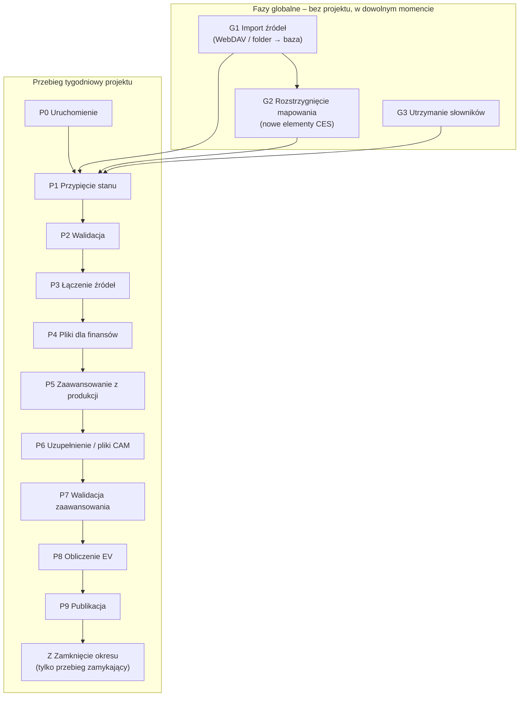

# PZL-EV – Przepływ: fazy i etapy

Zakres: jedyny opis przepływu – fazy globalne i etapy przebiegu tygodniowego: cel, wejście, bramki, działanie,
kontrole, efekt, przekazanie; statusy, kontrole jakości danych (problemy), współbieżność, zdarzenia w trakcie
przebiegu.

Powiązane: `docs/model-danych.md` (przebieg, znacznik stanu, rewizja), `docs/zrodla-danych.md` (źródła),
`docs/slowniki.md`, `docs/mapowanie-ces-p1s.md`, `docs/ev-obliczenia.md`, `docs/funkcjonalnosc.md` (ekrany).

---

## 1. Zasady wspólne

### 1.1 Kontrakt etapu

Każda faza i każdy etap mają ten sam kształt:

| Element | Znaczenie |
|---|---|
| **Wejście** | wyłącznie dane utrwalone w bazie: wyniki wcześniejszych etapów, importy, słowniki i mapowanie w stanie na znacznik stanu przebiegu – nigdy „z pamięci” poprzedniego kroku |
| **Bramka wejścia** | warunki, bez których etap nie ruszy |
| **Przetwarzanie** | dane – procedury i widoki bazy; obliczenie EV – silnik w aplikacji (`docs/architektura.md`, rozdz. 6) |
| **Wyjście** | tabele w bazie i ewentualne pliki; każdy rekord ma identyfikator pochodzenia (import, przebieg, rewizja) |
| **Bramka wyjścia** | kontrole, które muszą przejść, żeby następny etap mógł ruszyć |
| **Zapis stanu** | status etapu, kto, kiedy – `meta.EtapPrzebiegu` i dziennik |
| **Idempotencja** | ponowne wykonanie z tymi samymi wejściami daje ten sam wynik i nie dubluje danych |
| **Unieważnienie** | ponowne wykonanie etapu albo zmiana jego wejść oznacza etapy późniejsze jako **Nieaktualne** |
| **Uruchomienie** | każdy etap uruchamia użytkownik – analityk zachowuje kontrolę nad przebiegiem; nic nie wykonuje się automatycznie |

Etapy komunikują się przez bazę, więc mogą je wykonywać różne osoby, w różne dni, z różnych komputerów.

### 1.2 Statusy etapu

| Status | Znaczenie | Przejścia |
|---|---|---|
| Oczekuje | poprzednie etapy niezakończone | → Do wykonania |
| Do wykonania | można uruchomić akcję etapu | → W toku |
| W toku | operacja trwa (blokada przebiegu) | → Zakończony / Wymaga akcji / Błąd |
| Wymaga akcji | potrzebna decyzja lub dane (potwierdzenie, pliki CAM, uzupełnienia, przypisania) | → Zakończony / Do wykonania |
| Błąd | kontrola z poziomem ERROR | → Do wykonania (po poprawie) |
| Zakończony | bramka wyjścia spełniona | → Nieaktualny (gdy zmienią się wejścia) |
| Nieaktualny | wynik oparty na nieaktualnych wejściach | → Do wykonania |

- Stan przebiegu wynika ze stanów etapów – pierwszy niezakończony etap wyznacza „co dalej”.
- Każda zmiana statusu trafia do dziennika (kto, kiedy, co).

### 1.3 Problemy (kontrola jakości danych)

Każda kontrola – przy imporcie, mapowaniu, w etapach przebiegu i w silniku EVM – zapisuje wynik w jednej
tabeli problemów (`meta.Problem`).

| Poziom | Znaczenie | Skutek |
|---|---|---|
| PASS | kontrola przeszła | widoczna w raporcie przebiegu |
| WARNING | ostrzeżenie | nie blokuje; widoczne w raporcie przebiegu i na pulpicie |
| ERROR | błąd blokujący | blokuje bramkę etapu do czasu poprawy |

- Problem zawiera: poziom, kontrolę, obszar (import, mapowanie, słownik, etap przebiegu), element, opis,
  akcję naprawczą (przejście do właściwego ekranu z filtrem na problem) i stan (otwarty / rozwiązany).
- Pulpit „Wymaga uwagi” pokazuje otwarte problemy i etapy wymagające akcji – użytkownik widzi, co wymaga
  działania, a nie techniczny stan etapów.
- Walidacja przy zapisie słowników używa tych samych poziomów, ale błędny zapis jest od razu odrzucany
  (`docs/slowniki.md`, rozdz. 1).

### 1.4 Współbieżność

- Jeden przebieg na projekt i tydzień (`docs/model-danych.md`, rozdz. 4.1).
- Operacja w toku (np. import, łączenie) zakłada krótką blokadę (`sp_getapplock`); druga osoba widzi komunikat.
- Import jest idempotentny: ten sam hash pliku nie tworzy nowej wersji ani duplikatu danych.
- Równoczesna edycja słowników – `docs/slowniki.md`, rozdz. 1.

---

## 2. Mapa faz

| Faza | Zasięg | Kto | Kiedy |
|---|---|---|---|
| G1 Import źródeł | globalna | Analityk | w dowolnym momencie; co najmniej tak często, jak RABIT nadpisuje pliki (O31) |
| G2 Rozstrzygnięcie mapowania | globalna | automatycznie po G1; korekty – Analityk | po G1 |
| G3 Utrzymanie słowników | globalna | Analityk | w dowolnym momencie |
| P0–P9, Z | projekt | Analityk prowadzący przebieg (może go przejąć inny Analityk) | co tydzień |

---

## 3. Fazy globalne

### G1. Import źródeł

| | |
|---|---|
| **Cel** | Zapisać w bazie każdą nową wersję raportu RABIT, zanim RABIT ją nadpisze. |
| **Wejście** | Folder RABIT na SharePoint (WebDAV) albo folder `00_Global\RABIT\Do_importu` z plikami pobranymi ręcznie (`docs/zrodla-danych.md`, rozdz. 3); definicje źródeł. |
| **Działanie** | 1) Plik o tych samych metadanych (nazwa, rozmiar, data modyfikacji) co przy poprzednim imporcie jest pomijany bez czytania. 2) Rozpoznanie źródła po prefiksie nazwy. 3) Hash SHA-256 – ten sam hash oznacza duplikat. 4) Nowa treść: wiersze surowe ładowane wsadowo do bazy jako nowa wersja pliku. 5) Parser źródła tworzy dane kanoniczne (`docs/zrodla-danych.md`, rozdz. 2). Każdy plik osobno; błąd jednego pliku nie zatrzymuje pozostałych. |
| **Pochodzenie** | Każda wersja pliku i każdy wiersz: import (kto, kiedy), hash, kod źródła, data raportu (data modyfikacji w RABIT). |
| **Kontrole** | `docs/zrodla-danych.md`, rozdz. 8. |
| **Efekt** | `meta.ImportBatch`, `meta.SourceFile`, `meta.SourceFileSeen`, `stg.RawRow`, `can.*`; problemy importu. Historia importów widoczna dla wszystkich. |
| **Przekazanie** | G2 (nowe elementy CES), P1 (dane projektu). |

Decyzja dla pliku:

| Decyzja | Znaczenie |
|---|---|
| zaimportowany | rozpoznany plik o nowej treści |
| pominięty | te same metadane co przy poprzednim imporcie – plik nie był czytany |
| duplikat | ten sam hash jest już w bazie (także pod inną nazwą) – komunikat podaje, kto i kiedy go zaimportował |
| nierozpoznany | brak pasującego prefiksu – plik nie jest importowany |
| błąd | np. uszkodzony plik albo przekroczony limit WebDAV |

### G2. Rozstrzygnięcie mapowania CES ↔ P1S

| | |
|---|---|
| **Cel** | Dla każdego elementu WBS CES z danych znać jego element P1S (a przez zakres – projekt) i wychwycić elementy bez przypisania. |
| **Wejście** | Elementy CES z nowych wersji plików (G1); raport mapowań; korekty; drzewo P1S. |
| **Działanie** | Automatycznie po imporcie – kolejność rozstrzygania według `docs/mapowanie-ces-p1s.md`, rozdz. 5. Lista nowych elementów z wynikiem (`INHERITED`, `UNMAPPED`). |
| **Kontrole** | Element `UNMAPPED` z kosztem → WARNING na pulpicie. |
| **Akcje** | Korekta na ekranie Mapowanie CES ↔ P1S. |
| **Efekt** | Stan mapowania (wyliczany z raportu i korekt, nie zapisywany). |
| **Przekazanie** | P1 i P3 czytają mapowanie w stanie na znacznik stanu przebiegu. |

### G3. Utrzymanie słowników

| | |
|---|---|
| **Cel** | Utrzymywać słowniki globalne i słowniki projektów. |
| **Działanie** | Edycja w aplikacji albo wczytanie z Excela – zasady i walidacja w `docs/slowniki.md`. |
| **Efekt** | Nowy stan słowników w historii. |
| **Przekazanie** | Przebieg czyta słowniki w stanie na swój znacznik stanu (P1); zmiana po przypięciu – rozdz. 5. |

---

## 4. Przebieg tygodniowy

Przebieg to przetworzenie jednego projektu za jeden tydzień (definicja i identyfikator – `docs/model-danych.md`,
rozdz. 4.1). Można go uruchomić w dowolnym dniu tygodnia. Wszystkie typy projektów przechodzą te same etapy;
typ wyznacza pobierane słowniki (`docs/slowniki.md`, rozdz. 4).

Kalendarz okresów wyznacza wariant przebiegu:

- **przebieg w środku okresu** – zaawansowanie z raportu produkcji, braki uzupełnia analityk; wynik: EV wstępne;
- **przebieg zamykający okres** – tydzień oznaczony w kalendarzu jako zamknięcie okresu; zaawansowanie podaje
  CAM, a wartość z raportu produkcji jest dla niego podpowiedzią; po zatwierdzeniu przebieg jest zamrażany;
  wynik: EV formalne.

| Etap | Krok na ekranie | W środku okresu | W przebiegu zamykającym | Bramka wyjścia |
|---|---|---|---|---|
| P0 Uruchomienie | Przygotowanie przebiegu | tak | tak | kontrole przed startem |
| P1 Przypięcie stanu | Przygotowanie przebiegu | tak | tak | zapisany znacznik stanu |
| P2 Walidacja | Walidacja | tak | tak | brak ERROR |
| P3 Łączenie źródeł | Uzgodnienie | tak | tak | suma kontrolna; elementy bez przypisania przypisane albo świadomie pominięte |
| P4 Pliki dla finansów | Przegląd finansów | tak | tak | potwierdzenie |
| P5 Zaawansowanie z produkcji | Zaawansowanie | tak | tak – jako podpowiedź | zaawansowanie pobrane |
| P6 Uzupełnienie zaawansowania | Zaawansowanie | uzupełnienie braków przez analityka | pliki CAM | braki uzupełnione / pliki wszystkich CAM zaimportowane |
| P7 Walidacja zaawansowania | Zaawansowanie | tak | tak + 100% wartości od CAM | brak ERROR |
| P8 Obliczenie EV | Obliczenie i przegląd | tak | tak | rewizja zapisana |
| P9 Publikacja | Publikacja | tak | tak | pliki zapisane |
| Z Zamknięcie okresu | Zamrożenie | – | tak | zatwierdzenie |

### P0. Uruchomienie

| | |
|---|---|
| **Cel** | Założyć przebieg projektu za tydzień. |
| **Działanie** | Wybór tygodnia (domyślnie bieżący). Aplikacja pokazuje okres i to, czy przebieg zamyka okres (kalendarz okresów), oraz datę stanu (`docs/ev-obliczenia.md`, rozdz. 2). |
| **Bramka wejścia** | brak innego przebiegu projektu w tym tygodniu (ERROR); zgodna wersja aplikacji i schematu (ERROR); tydzień jest w kalendarzu okresów (ERROR); projekt gotowy – wymagane słowniki projektu dla typu (`docs/funkcjonalnosc.md`, F02; ERROR); świeżość danych produkcyjnych – data odświeżenia `vAHDD` (WARNING). |
| **Efekt** | Przebieg `R-<Projekt>-<RRRR-MM>-T<NN>`, pierwsze zdarzenie w dzienniku. |
| **Przekazanie** | P1. |

### P1. Przypięcie stanu

| | |
|---|---|
| **Cel** | Ustalić, na jakich danych liczy przebieg. |
| **Działanie** | Aplikacja pokazuje, co zmieniło się od poprzedniego przebiegu projektu: nowe wersje plików i datę ostatniego importu, zmiany słowników i korekt mapowania (kto, kiedy). **Przypnij** zapisuje znacznik stanu (`docs/model-danych.md`, rozdz. 4.2). Procedury wybierają dane projektu: wiersze elementów P1S z zakresu projektu i elementów CES przypisanych do nich w mapowaniu, w okresie przebiegu (koszt okresu i narastająco – O30). |
| **Kontrole** | pliki nierozpoznane od ostatniego importu (WARNING); ostatni import starszy niż próg świeżości (O29; WARNING); elementy `UNMAPPED` z kosztem (WARNING; rozstrzygane w P3). |
| **Efekt** | Znacznik stanu w przebiegu; zestawienie danych projektu (liczba wierszy, koszt). |
| **Przekazanie** | P2–P9 pracują wyłącznie na stanie ze znacznika. |

### P2. Walidacja

| | |
|---|---|
| **Cel** | Nie dopuścić niespójnych danych i słowników do obliczeń. |
| **Działanie** | Poprawność samych słowników zapewnia walidacja przy zapisie (`docs/slowniki.md`, rozdz. 5), a plików – import (`docs/zrodla-danych.md`, rozdz. 8). Tu: spójność danych projektu ze słownikami i okresem. |
| **Kontrole** | wydział z kosztów bez stawki na dany rok – stawki wydziałów albo, w CAS, stawki CAS (ERROR); numer elementu kosztowego bez wpisu w efektywnym słowniku Cost Category (ERROR – O25; naprawa: pozycja w słowniku projektu); numer bez kategorii (WARNING); WP bez budżetu (WARNING); daty księgowania niezgodne z okresem przebiegu według znaczenia okresu w definicji źródła (ERROR); duplikaty wierszy między częściami źródła (ERROR). |
| **Przy ERROR** | **Popraw w aplikacji** (ekran Słowniki albo Mapowanie z filtrem na problem) → **Przypnij ponownie** (P1) i waliduj. |
| **Efekt** | Problemy przebiegu; WARNING trafiają do raportu przebiegu. |
| **Przekazanie** | P3 rusza tylko bez ERROR. |

### P3. Łączenie źródeł

| | |
|---|---|
| **Cel** | Jeden spójny obraz kosztów projektu: koszt rzeczywisty (ACWP) przypisany do WP, CAM i kategorii kosztów, w walucie wyniku. |
| **Działanie** | Procedury w bazie (logika – O14): element CES → element P1S (mapowanie) → WP (słownik „WP i CAM”); przeliczenie godzin na koszt według stawek wydziałów albo stawek CAS (typ projektu); przeliczenie waluty według kursów. Podsumowanie: koszt okresu, liczba zmapowanych elementów, liczba WP, suma kontrolna. |
| **Kontrole** | suma kontrolna: koszt po połączeniu = koszt danych projektu (ERROR). **Elementy bez przypisania:** element CES `UNMAPPED` z kosztem, element P1S z zaawansowaniem bez WP, `PROJORG` należący do innego projektu – WARNING w środku okresu, ERROR w przebiegu zamykającym (O33). |
| **Akcje** | **Przypisz** – korekta mapowania (ekran Mapowanie) albo słownik „WP i CAM” → przypnij ponownie (P1). **Kontynuuj bez tych elementów** – tylko w środku okresu; decyzja w dzienniku, wartość poza EV pokazana w raporcie przebiegu. |
| **Efekt** | `ev.KosztWP` (przebieg, WP, okres, kwoty, pochodzenie) i raport pokrycia. |
| **Przekazanie** | P4; P8 (ACWP). |

### P4. Pliki dla finansów

| | |
|---|---|
| **Cel** | Dać finansom do sprawdzenia wynik łączenia, zanim zostanie użyty dalej. |
| **Działanie** | Generuje pliki do `Projekty\<Projekt>\Finanse\<RRRR-MM>\` (`docs/funkcjonalnosc.md`, rozdz. 4; zawartość – O16) i czeka na decyzję: **Potwierdź** (może osoba prowadząca przebieg; zapis kto i kiedy) albo **Odrzuć** (wymagany komentarz). |
| **Przekazanie** | Potwierdzenie odblokowuje P5; odrzucenie cofa do P3 (P4 i dalsze – Nieaktualne). |

### P5. Zaawansowanie z produkcji

| | |
|---|---|
| **Cel** | Pobrać zaawansowanie godzin i materiałów z produkcji dla WP projektu. |
| **Działanie** | Odczyt zaawansowania (`docs/zrodla-danych.md`, rozdz. 6) dla elementów P1S projektu i przypisanie do WP; zapis w `ev.Zaawansowanie` z pochodzeniem `PRODUKCJA`. Wynik: liczba WP z wartością, lista WP bez wartości. W przebiegu zamykającym wartość jest podpowiedzią dla CAM (P6). |
| **Przekazanie** | P6. |

### P6. Uzupełnienie zaawansowania

| | W środku okresu | W przebiegu zamykającym |
|---|---|---|
| **Działanie** | Tabela WP bez wartości (WP, CAM, ostatnia znana wartość, metoda, wartość). Metody: ostatnia znana wartość, wartość ręczna (zasady – O11). Zapis z pochodzeniem `ANALITYK`, kto, kiedy, metoda. | **Generuj pliki dla CAM** – jeden plik na CAM do `CAM\<RRRR-MM>\Wyslane\`, z wartością z produkcji jako podpowiedzią (format – `docs/zrodla-danych.md`, rozdz. 7). **Skanuj folder Zwrócone** – status per CAM: wysłany / zwrócony / zaimportowany / odrzucony (z powodem). Etap czeka (dni), aż pliki wszystkich CAM zostaną zaimportowane. Pochodzenie `CAM`. |
| **Bramka wyjścia** | braki uzupełnione | pliki wszystkich CAM zaimportowane (O34) |

- Każda zmiana wartości to nowy wpis z pochodzeniem – wpis ręczny nie nadpisuje wartości bez śladu.
- Ponowne wykonanie etapu wykorzystuje wartości już zapisane w przebiegu (np. zaimportowane pliki CAM);
  zmienia je tylko nowa akcja użytkownika.

### P7. Walidacja zaawansowania

| | |
|---|---|
| **Działanie** | Udział wartości według pochodzenia (wykres paskowy) i kontrole. |
| **Kontrole** | wartość w zakresie 0–100% (ERROR); spadek względem poprzedniego okresu (WARNING); w przebiegu zamykającym – 100% wartości od CAM (ERROR). |
| **Przekazanie** | P8 rusza tylko bez ERROR. |

### P8. Obliczenie EV

| | |
|---|---|
| **Cel** | Policzyć wskaźniki EV projektu w sposób odtwarzalny. |
| **Działanie** | Silnik EVM (`docs/ev-obliczenia.md`) liczy wskaźniki na poziomach WP, CAM, `PROJORG` i projektu; wynik zapisywany jako rewizja (`docs/model-danych.md`, rozdz. 4.3). Przegląd wyniku w aplikacji. **Przelicz ponownie** tworzy nową rewizję – poprzednie zostają. |
| **Kontrole** | `docs/ev-obliczenia.md`, rozdz. 5. |
| **Efekt** | Rewizja R*n* w `ev.Wynik`. |
| **Przekazanie** | P9. |

### P9. Publikacja

| | |
|---|---|
| **Działanie** | Plik wyniku EV do `EV\<RRRR-MM>\`; w projektach SAC plik dla Cobra (koszt pracy przeliczony po bieżących stawkach na USD, zaawansowanie według WP); wynik dostępny w widokach dla BI. Nazwy plików – `docs/funkcjonalnosc.md`, rozdz. 4. |
| **Przekazanie** | W środku okresu – koniec przebiegu. W przebiegu zamykającym – Z. |

### Z. Zamknięcie okresu

| | |
|---|---|
| **Bramka wejścia** | Przebieg zamykający; etapy P0–P9 zakończone. |
| **Działanie** | **Zatwierdź zamknięcie okresu** – wskazana rewizja staje się formalnym wynikiem okresu; przebieg zostaje zamrożony (tylko do odczytu). |
| **Efekt** | Zamrożony wynik okresu – podstawa raportów i porównań kolejnych okresów. |

---

## 5. Zdarzenia w trakcie przebiegu

| Zdarzenie | Zachowanie |
|---|---|
| **Zmiana po przypięciu** – nowe wersje plików, zmiany słowników lub korekt mapowania | Baner w przebiegu: co się zmieniło, kto, kiedy, liczba zmian. **Kontynuuj na przypiętym stanie** – decyzja w dzienniku, baner znika dla tych zmian. **Przypnij ponownie** – nowy znacznik stanu (P1); etapy od P2 – Nieaktualne. |
| **Kontynuacja przez inną osobę** | Każdy Analityk może wykonać dowolną akcję w dowolnym przebiegu. Ekran przebiegu pokazuje, kto ostatnio pracował; każda akcja jest w dzienniku z kontem AD. |

Zamrożonego przebiegu zmiany nie dotyczą.

---

## 6. Co przepływa między fazami

| Z → Do | Nośnik | Identyfikator łączący |
|---|---|---|
| G1 → G2, P1 | wersje plików, dane kanoniczne | hash SHA-256, import, kod źródła |
| G2 → P1, P3 | stan mapowania (raport + korekty) | element CES, znacznik stanu |
| G3 → P1 | słowniki | znacznik stanu |
| P1 → P2–P9 | znacznik stanu, dane projektu | przebieg, znacznik stanu |
| P2 → P3 | problemy | przebieg |
| P3 → P4, P8 | `ev.KosztWP` | przebieg |
| P4 → P5 | potwierdzenie | przebieg |
| P5, P6 → P7 → P8 | `ev.Zaawansowanie` | przebieg, pochodzenie |
| P8 → P9, Z | `ev.Wynik` | przebieg, rewizja |

---

## 7. Otwarte kwestie

| # | Kwestia |
|---|---|
| O11 | Zasady uzupełniania braków zaawansowania w środku okresu (metody, metoda domyślna) |
| O14 | Logika łączenia źródeł (P3) – do przedstawienia przez zespół |
| O29 | Próg świeżości importu przed przypięciem (ile dni od ostatniego importu) |
| O31 | Harmonogram importu względem harmonogramu RABIT (RABIT nadpisuje pliki – wersja pośrednia bez importu przepada); import uruchamiany harmonogramem zadań Windows? |
| O33 | Element `UNMAPPED` z kosztem w przebiegu zamykającym: czy dopuścić zamknięcie (koszt liczony na poziomie projektu CES), czy – jak dziś – wymagać przypisania? Rekomendacja: wymagać przypisania |
| O34 | CAM nie odesłał pliku w przebiegu zamykającym: blokada etapu (dziś) czy przyjęcie wartości z produkcji z oznaczeniem pochodzenia? |
