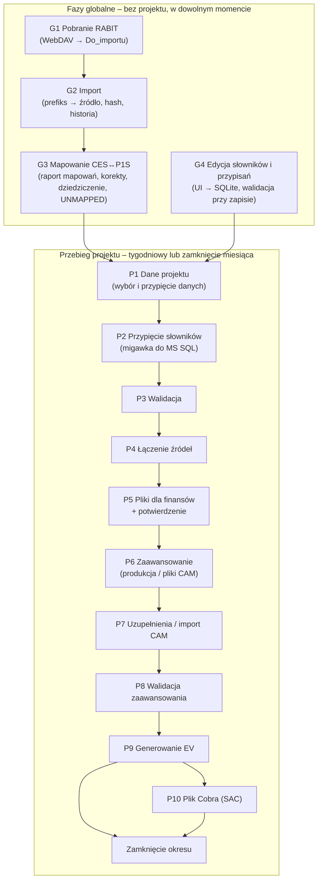

# PZL-EV – Fazy pipeline (koncepcja)

Wersja: 0.4 (koncepcja do dyskusji; 0.3: słowniki w bazie z interfejsem – M13/M15, D26–D27;
0.4: „projekt” zamiast „zakresu” – M22, mapowanie z raportu mapowań – M16–M18, kompletność źródeł projektów usunięta – M21, Cost Category – M26)
Powiązane: `docs/architektura.md`, `docs/funkcjonalnosc.md`, `docs/mvp-etap1.md` (faza G1–G2 – działa).

---

## 1. Zasady wspólne dla wszystkich faz („kontrakt klocka”)

Każda faza jest osobnym klockiem o tym samym kształcie:

| Element | Znaczenie |
|---|---|
| **Wejście** | czyta **wyłącznie** dane utrwalone przez wcześniejsze fazy (tabele w bazie, zarejestrowane pliki, przypięty stan słowników – migawka w MS SQL, D27) – nigdy „z pamięci” poprzedniego kroku |
| **Bramka wejścia** | warunki, bez których faza nie ruszy (np. poprzednia faza zakończona, słowniki projektu kompletne) |
| **Przetwarzanie** | logika biznesowa w bazie (procedury SQL); Python orkiestruje, czyta i zapisuje pliki |
| **Wyjście** | tabele w bazie + ewentualne pliki; każdy rekord ma identyfikator pochodzenia (import, przebieg, stan słowników) |
| **Bramka wyjścia** | kontrole, które muszą przejść, żeby następna faza mogła ruszyć |
| **Zapis stanu** | status fazy, kto, kiedy, **identyfikatory wejść** (hashe plików, znacznik stanu słowników, rewizje) – w `meta.EtapPrzebiegu` i dzienniku |
| **Idempotencja** | ponowne uruchomienie z tymi samymi wejściami daje ten sam wynik i nie dubluje danych |
| **Unieważnienie** | zmiana wejść fazy oznacza ją i wszystkie późniejsze jako **nieaktualne** |

Komunikacja między klockami odbywa się **przez bazę**: faza N zapisuje wynik i status, faza N+1 sprawdza
status i identyfikatory wejść. Dzięki temu fazy mogą być wykonywane przez różne osoby, w różne dni,
z różnych komputerów.

---

## 2. Mapa faz

| Faza | Zasięg | Kto | Kiedy | Stan |
|---|---|---|---|---|
| G1 Pobranie RABIT | globalna | dowolna osoba z finansów / harmonogram | co najmniej tak często jak RABIT | **działa** |
| G2 Import | globalna | j.w. | po G1 (razem) | **działa** |
| G3 Mapowanie CES↔P1S | globalna | automatycznie po G2, decyzje – finanse (UI) | po G2 | koncepcja |
| G4 Edycja słowników i przypisań | globalna | dowolna osoba z finansów (UI) | w dowolnym momencie | koncepcja |
| P1–P10 | projekt | osoba prowadząca projekt | tydzień / zamknięcie | prototyp |

---

## 3. Fazy globalne

Kontekst: **RABIT** automatycznie (także pod nieobecność pracownika) zrzuca wyniki różnych raportów SAP
na SharePoint i przy każdym uruchomieniu **nadpisuje ten sam plik**. Na etapie pobierania nie wiadomo,
czego dotyczy plik – o tym decyduje dopiero G2 na podstawie definicji plików (do ustalenia później).

### G1. Pobranie plików RABIT *(działa – do uzupełnienia o wersjonowanie)*

| | |
|---|---|
| **Cel** | Nie zgubić żadnej wersji raportu zrzuconej przez RABIT i mieć ją na dysku firmy. |
| **Wejście** | Folder RABIT na SharePoint (WebDAV, konto Windows). |
| **Jak pracuje** | Porównuje pliki źródłowe z ostatnio pobranymi (rozmiar, data modyfikacji); kopiuje tylko nowe i zmienione. Nie interpretuje treści. |
| **Nazwy plików** | Proste, bez projektu, dat i wersji (np. `ACTUALS_PAF_01.xlsx`); o źródle decyduje prefiks. G1 zachowuje nazwę z RABIT. |
| **Ryzyko** | RABIT nadpisuje plik – jeśli między dwoma uruchomieniami RABIT nie było pobrania i importu, poprzednia wersja przepada. Dlatego G1 i G2 uruchamia się razem i co najmniej tak często jak RABIT (np. harmonogram zadań Windows); historia wersji jest w bazie (hash), nie w nazwach plików. |
| **Kontrole** | Dostępność WebDAV; limit 50 MB (większy plik – ręcznie). |
| **Efekt** | Aktualna kopia plików RABIT w `00_Global\RABIT\Do_importu`. |
| **Przekazanie** | Folder `Do_importu` jest wejściem G2. |

### G2. Import *(działa: rozpoznanie po prefiksie, hash, historia; tabele typowane – po zdefiniowaniu raportów)*

| | |
|---|---|
| **Cel** | Każdy **rozpoznany** plik załadować do bazy jako źródło z markerem pochodzenia – tak, żeby dało się odtworzyć dowolny wcześniejszy stan i porównać dwa stany. |
| **Zasada** | **Plik mówi, czym jest** (prefiks nazwy → źródło). Zakres danych projektu wynika z jego węzłów w drzewie P1S; jedna paczka RABIT może obejmować wiele projektów, np. całe PWC (M21). |
| **Wejście** | Pliki w `Do_importu`; konfiguracja prefiksów (Prefiks → KodZrodla) w bazie słowników – M15 (w MVP przejściowo `konfiguracja/zrodla_rabit.csv`). |
| **Jak pracuje** | 1) Prefiks nazwy → źródło (najdłuższy pasujący prefiks, bez rozróżniania wielkości liter). 2) Hash SHA-256: ten sam fizyczny plik = duplikat. 3) Nowa treść → Landing Zone + wiersze w bazie. Każdy rozpoznany plik osobno – także `ACTUALS_PAF_01/_02/_03` o różnych kolumnach. |
| **Marker pochodzenia** | Każdy plik (i przez niego każdy wiersz): `IdImportu` (kto, kiedy), `Sha256`, **kod źródła**, **data raportu** (data modyfikacji w RABIT). Jedna wersja pliku = jeden snapshot. |
| **Archiwalność** | Tylko dopisywanie. Każda nowa treść nadpisanego przez RABIT pliku to nowa wersja w historii; oryginał w Landing Zone. Widok „najnowszy stan” i porównanie wersji – na tej historii. |
| **Kontrole** | Brak prefiksu → „nierozpoznany” (nie importowany; po dopisaniu prefiksu zaimportuje się przy kolejnym uruchomieniu). Uszkodzony plik → „błąd” (reszta importuje się dalej). |
| **Efekt** | `meta.SourceFile` (hash, kod źródła, kolumny, liczba wierszy), `meta.SourceFileSeen` (decyzja dla każdego pliku w każdym imporcie), `stg.RawRow` / `stg.vRawRowZrodlo`. |
| **Później** | Tabele typowane per źródło (mapowanie kolumn), gdy będzie wiadomo, co zawierają raporty. |
| **Przekazanie** | Historia importów źródeł jest wejściem G3 (elementy WBS) i P1 (dane projektu – przebieg przypina wszystkie zaimportowane pliki, M21). |

### G3. Mapowanie CES ↔ P1S *(koncepcja – `docs/mapowanie-ces-p1s.md`, D25)*

| | |
|---|---|
| **Cel** | Wiedzieć o **każdym elemencie WBS CES** z danych, do którego elementu P1S (i przez to projektu) należy – i szybko wychwycić te bez decyzji. Część administracyjna, bez kosztów (M16). |
| **Wejście** | Raport mapowań SAP↔CES z `PZLPROD` (tylko odczyt, M16); elementy CES (`Project Definition`, `WBS Element`) z nowych snapshotów G2; drzewo P1S i kategoryzacja z `PZLPROD.LOG.WBS` (M20); korekty z bazy słowników (SQLite, M18). |
| **Jak pracuje** | Rozstrzyganie po `pspnr`: korekta elementu (`OVERRIDE`) → raport (`REPORT`) → WBS spoza raportu: cel projektu CES z korekty projektu albo z raportu (`INHERITED`) → `UNMAPPED` (M16–M18). |
| **Kontrole** | Co najwyżej jeden cel P1S na element CES (M3); zmiana względem raportu z uzasadnieniem; element bez celu → `UNMAPPED` (alert na pulpicie, z kosztem – liczony, ale poza EV, M9). `NO_P1S` odłożony (M14). |
| **Efekt** | Lista nowych elementów z wynikiem (`INHERITED`, `UNMAPPED`); dwa drzewa w strukturze kategoryzacji z węzłem „Nieprzypisane” (M19). Źródłem prawdy jest raport + korekty, nie rekordy pochodne. |
| **Przekazanie** | Korekty zapisywane w UI (ekran Mapowanie CES ↔ P1S). P1 i P4 korzystają ze stanu mapowania; przypinanie stanu raportu – O19; zamknięcie z kosztem `UNMAPPED` – pytanie P10. |

> *Wcześniej (zastąpione: M16–M18):* wejście – reguły mapowania z bazy słowników; rozstrzyganie – wyjątek
> WBS → reguła projektu (dziedziczenie) → automatyczna propozycja (kody / opisy, M12) → `UNMAPPED`.

### G4. Edycja słowników i przypisań *(koncepcja)*

| | |
|---|---|
| **Cel** | Utrzymywać słowniki globalne i słowniki projektów (stawki wydziałów, kalendarz okresów, kursy USD/PLN, stawki CAS, WP i CAM, harmonogram i budżet, Cost Category globalny i zmiany w projekcie (M26), korekty mapowania CES↔P1S (M18), **konfiguracja prefiksów RABIT** (~~i źródeł projektów~~ – usunięte, M21)). |
| **Wejście** | Zmiany wprowadzane w aplikacji (CRUD + drzewo) albo wczytane z Excela z tą samą walidacją i podglądem różnic (słowniki projektu, Cost Category – M24, M26). Źródłem prawdy jest baza (M13). |
| **Jak pracuje** | Zapis do bazy słowników SQLite (`00_Global\Baza\`) w krótkiej transakcji → walidacja przy zapisie (rozdz. 6 specyfikacji) → historia SCD2 (`ValidFrom`/`ValidTo`, kto, kiedy). |
| **Kontrole** | Błąd blokujący nie pozwala zapisać; jednocześnie zapisuje jedna osoba (SQLite na dysku sieciowym). |
| **Efekt** | Nowy stan słowników z historią. |
| **Przekazanie** | Przebieg przypina stan w P2 i kopiuje migawkę do MS SQL (D27); aktywne przebiegi z wcześniejszym stanem dostają decyzję „kontynuuj / przelicz od P3”. |

---

## 4. Fazy przebiegu projektu

Przebieg = jeden projekt × okres (tydzień albo zamknięcie miesiąca). Stan przebiegu jest w bazie,
fazy mogą być wykonywane w różne dni i przez różne osoby z finansów.

### P1. Dane projektu

| | |
|---|---|
| **Cel** | Wybrać z danych globalnych **tylko to, co należy do projektu i okresu**, i zamrozić ten wybór na czas przebiegu. |
| **Wejście** | Tabele raportów z G2 (najnowsze snapshoty); stan mapowania z G3; zakres P1S projektu (węzły drzewa – M23) i WP (baza słowników); kalendarz okresów. |
| **Jak pracuje** | **Przypina wszystkie zaimportowane pliki** (lista hashy, M21) – analogicznie do przypinania stanu słowników – i wybiera z nich wiersze elementów projektu (zakres P1S z drzewa – M23, elementy CES przez mapowanie) oraz dat okresu (koszt okresu i narastająco). |
| **Kontrole** | Pliki „nierozpoznane” (ostrzeżenie); elementy `UNMAPPED` z G3 (ostrzeżenie; zamknięcie – blokada); daty w okresie. |
| **Efekt** | Snapshot danych projektu `hist.DaneZakresu` (RunId, Sha256) + lista przypiętych plików. |
| **Przekazanie** | P2–P4 pracują wyłącznie na tym snapshocie. Nowy import w trakcie przebiegu → informacja „dostępne nowsze dane” i decyzja: kontynuuj / przelicz od P1. |

### P2. Przypięcie słowników

| | |
|---|---|
| **Cel** | Zamrozić stan słowników (globalnych i projektu – w tym oba słowniki Cost Category, M26), na którym liczy przebieg. Stan raportu mapowań – O19. |
| **Wejście** | Baza słowników (SQLite) – stan po edycjach z G4. |
| **Jak pracuje** | Zapis znacznika stanu w przebiegu + **kopia migawki** słowników projektu i globalnych do MS SQL, schemat `dict` (D27) – procedury w MS SQL nie czytają SQLite. |
| **Efekt** | `dict.StanSlownikow` (RunId, znacznik) + tabele `dict.*` z migawką. |
| **Przekazanie** | P3–P9 czytają wyłącznie migawkę. Zmiana słowników później → baner i decyzja „kontynuuj / przelicz od P3”. |

### P3. Walidacja

| | |
|---|---|
| **Cel** | Nie dopuścić niespójnych danych i słowników do obliczeń. |
| **Wejście** | Migawka słowników z P2; snapshot danych z P1. |
| **Jak pracuje** | Poprawność samych słowników zapewnia walidacja przy zapisie (G4). Tu: kontrole **spójności słowników z danymi przebiegu** (np. wydział z kosztów bez stawki, element z kosztem `UNMAPPED`, WP bez budżetu, numer elementu kosztowego bez wpisu w Cost Category – blokujący, O25; numer bez kategorii – ostrzeżenie; M26) + kontrole danych. |
| **Kontrole** | Błąd blokujący → poprawa w aplikacji (ekran Słowniki / Mapowanie CES ↔ P1S) → ponowne przypięcie (P2) i walidacja. |
| **Efekt** | Lista problemów (blokujące / ostrzeżenia) zapisana w przebiegu. |
| **Przekazanie** | P4 startuje tylko bez błędów blokujących. |

### P4. Łączenie źródeł

| | |
|---|---|
| **Cel** | Zbudować jeden spójny obraz projektu: koszt rzeczywisty (ACWP) przypisany do WP, CAM, kategorii kosztów, w walucie raportowej. |
| **Wejście** | Snapshot danych (P1), przypięte słowniki (P3), stawki i kursy. |
| **Jak pracuje** | Logika łączenia w bazie (**do przedstawienia przez zespół – O14**): mapowanie WBS CES → WP, przeliczenia stawek (CAS / SAP), przeliczenie godzin na koszt, waluta. |
| **Kontrole** | Elementy bez przypisania (z rejestru G3) – tydzień: można pominąć z decyzją, zamknięcie: nie; suma kontrolna (koszt po połączeniu = koszt ze snapshotu). |
| **Efekt** | `ev.KosztWP` (RunId, WP, okres, kwoty, pochodzenie) + raport pokrycia. |
| **Przekazanie** | P5 generuje z tego pliki dla finansów; P9 używa jako ACWP. |

### P5. Pliki dla finansów + potwierdzenie

| | |
|---|---|
| **Cel** | Dać finansom do sprawdzenia wynik łączenia, zanim zostanie użyty dalej (i wysłany do CAM). |
| **Wejście** | `ev.KosztWP`, raport pokrycia z P4. |
| **Jak pracuje** | Generuje pliki do `Projekty\<Projekt>\Finanse\<RRRR-MM>\` (zawartość – O16); czeka na potwierdzenie w aplikacji. |
| **Kontrole** | Potwierdzenie (może je wykonać osoba prowadząca) albo odrzucenie z komentarzem. |
| **Efekt** | Pliki + zapis potwierdzenia (kto, kiedy). |
| **Przekazanie** | Potwierdzenie odblokowuje P6; odrzucenie cofa do P4 (P5+ nieaktualne). |

### P6–P8. Zaawansowanie

Dwa warianty, ten sam cel: **dla każdego WP wartość zaawansowania z zapisanym pochodzeniem**.

| | Tydzień | Zamknięcie miesiąca |
|---|---|---|
| **P6** | Pobranie zaawansowania z danych produkcyjnych P1S (np. `vAHDD`, źródło – O10) po P1S WBS projektu | Generowanie **pliku na CAM** (WP danego CAM z przypisań WP → CAM; ukryty identyfikator przebiegu; zablokowane komórki) do `CAM\…\Wyslane` |
| **P7** | Uzupełnienie braków przez analityka (metody – O11) | Import plików z `CAM\…\Zwrocone` (kontrola identyfikatora, okresu, zmian poza polami); status per CAM; może trwać dni |
| **P8** | Walidacja: 0–100%, spadki vs poprzedni okres, EV ≤ BAC; wartości spoza CAM dozwolone | Te same kontrole + **100% wartości od CAM** |
| **Efekt** | `ev.Zaawansowanie` (WP, okres, wartość, pochodzenie: PRODUKCJA / ANALITYK / CAM, kto, kiedy) | j.w., pochodzenie wyłącznie CAM |
| **Przekazanie** | P9 czyta `ev.Zaawansowanie` i status P8 | j.w. |

### P9. Generowanie EV

| | |
|---|---|
| **Cel** | Policzyć wskaźniki EV projektu w sposób odtwarzalny. |
| **Wejście** | `ev.KosztWP` (ACWP), `ev.Zaawansowanie`, budżet i harmonogram (BAC, BCWS) z migawki słowników, ETC (źródło – O15). |
| **Jak pracuje** | Kalkulacja w bazie: BCWS, BCWP, ACWP, CPI, SPI, EAC, TCPI – na WP, CAM, PROJORG, projekt. |
| **Kontrole** | Spójność sum na poziomach; EV ≤ BAC. |
| **Efekt** | **Rewizja** wyników `ev.Wynik` (R1, R2…) z listą przypiętych wejść (hashe plików, stan słowników, rewizja zaawansowania) + plik `EV\<RRRR-MM>\…`. |
| **Przekazanie** | Tydzień: EV wstępne (koniec przebiegu). Zamknięcie: P10 (SAC) i zatwierdzenie okresu. |

### P10. Plik dla Cobra (tylko SAC)

| | |
|---|---|
| **Cel** | Przekazać Sikorsky dane w formacie Cobra. |
| **Wejście** | Rewizja EV z P9, stawki bieżące, kurs USD. |
| **Efekt** | `EV\<RRRR-MM>\<Projekt>_<RRRR-MM>_Cobra_import.csv`. |

### Zamknięcie okresu

| | |
|---|---|
| **Cel** | Zamrozić formalny wynik miesiąca. |
| **Jak pracuje** | Zatwierdzenie w aplikacji; przebieg staje się tylko do odczytu. Ponowne przeliczenie = nowa rewizja w historii. |
| **Efekt** | Zamrożona rewizja EV – podstawa raportów i porównań kolejnych okresów. |

---

## 5. Co przepływa między fazami (podsumowanie)

| Z → Do | Nośnik | Identyfikator łączący |
|---|---|---|
| G1 → G2 | pliki w `Do_importu` | nazwa, rozmiar, data |
| G2 → G3, P1 | tabele raportów (snapshoty) | IdImportu + Sha256 + data raportu |
| G3 → P1, P4 | stan mapowania CES↔P1S (reguły + wynik rozstrzygania) | element WBS + znacznik stanu |
| G4 → P2 | baza słowników (SQLite) | znacznik stanu |
| P1 → P2–P4 | `hist.DaneZakresu`, lista przypiętych plików | RunId + Sha256 |
| P2 → P3–P9 | migawka `dict.*` w MS SQL | RunId + znacznik stanu |
| P3 → P4 | lista problemów, status walidacji | RunId |
| P4 → P5, P9 | `ev.KosztWP` | RunId |
| P5 → P6 | potwierdzenie | RunId + status |
| P6/P7 → P8 → P9 | `ev.Zaawansowanie` | RunId + pochodzenie |
| P9 → P10, zamknięcie | `ev.Wynik` | RunId + rewizja |

---

## 6. Otwarte kwestie wynikające z koncepcji

| # | Kwestia |
|---|---|
| K1 | Rzeczywiste prefiksy plików RABIT (docelowo w bazie słowników – M15; w MVP CSV); później mapowanie kolumn źródeł na tabele typowane |
| K5 | Harmonogram G1+G2 względem harmonogramu RABIT (nadpisywanie plików) |
| K6 | *(zob. `docs/mapowanie-ces-p1s.md` – propozycje poziomu 3)* Reguły kluczy w G3: po czym rozpoznać projekt (segment WBS, Project Definition, Business Area…) i czy reguła tylko proponuje, czy przypisuje |
| K7 | Retencja snapshotów (wolumen: setki tysięcy wierszy × raporty × tygodnie) |
| K2 | Co zawierają poszczególne pliki RABIT (koszty, zobowiązania, „PZL roll”, „hedge”, „workaround”) i które fazy ich używają |
| K3 | Próg „świeżości” danych przed P1 (ile dni od ostatniego importu) |
| K4 | Koszt okresu vs narastająco – jak liczyć ACWP przy korektach wstecznych w SAP |
| O10, O11, O14–O17 | jak w `docs/architektura.md` / `docs/funkcjonalnosc.md` |
