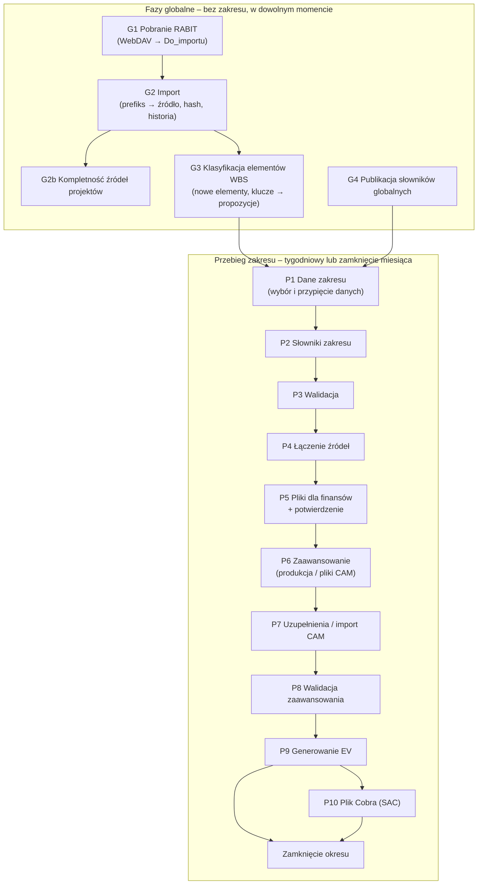

# PZL-EV – Fazy pipeline (koncepcja)

Wersja: 0.2 (koncepcja do dyskusji)
Powiązane: `docs/architektura.md`, `docs/funkcjonalnosc.md`, `docs/mvp-etap1.md` (faza G1–G2 – działa).

---

## 1. Zasady wspólne dla wszystkich faz („kontrakt klocka”)

Każda faza jest osobnym klockiem o tym samym kształcie:

| Element | Znaczenie |
|---|---|
| **Wejście** | czyta **wyłącznie** dane utrwalone przez wcześniejsze fazy (tabele w bazie, zarejestrowane pliki, przypięte wersje słowników) – nigdy „z pamięci” poprzedniego kroku |
| **Bramka wejścia** | warunki, bez których faza nie ruszy (np. poprzednia faza zakończona, słownik ma zatwierdzoną wersję) |
| **Przetwarzanie** | logika biznesowa w bazie (procedury SQL); Python orkiestruje, czyta i zapisuje pliki |
| **Wyjście** | tabele w bazie + ewentualne pliki; każdy rekord ma identyfikator pochodzenia (import, przebieg, wersja) |
| **Bramka wyjścia** | kontrole, które muszą przejść, żeby następna faza mogła ruszyć |
| **Zapis stanu** | status fazy, kto, kiedy, **identyfikatory wejść** (hashe plików, wersje słowników, rewizje) – w `meta.EtapPrzebiegu` i dzienniku |
| **Idempotencja** | ponowne uruchomienie z tymi samymi wejściami daje ten sam wynik i nie dubluje danych |
| **Unieważnienie** | zmiana wejść fazy oznacza ją i wszystkie późniejsze jako **nieaktualne** |

Komunikacja między klockami odbywa się **przez bazę**: faza N zapisuje wynik i status, faza N+1 sprawdza
status i identyfikatory wejść. Dzięki temu fazy mogą być wykonywane przez różne osoby, w różne dni,
z różnych komputerów.

---

## 2. Mapa faz

| Faza | Zakres | Kto | Kiedy | Stan |
|---|---|---|---|---|
| G1 Pobranie RABIT | globalna | dowolna osoba z finansów / harmonogram | co najmniej tak często jak RABIT | **działa** |
| G2 Import | globalna | j.w. | po G1 (razem) | **działa** |
| G2b Kompletność źródeł projektów | globalna | dowolna osoba z finansów | po G2 | **działa** (podstawowo) |
| G3 Klasyfikacja elementów WBS | globalna | automatycznie po G2, decyzje – finanse | po G2 | koncepcja |
| G4 Słowniki globalne | globalna | właściciel słownika | przy zmianie | koncepcja |
| P1–P10 | zakres | osoba prowadząca zakres | tydzień / zamknięcie | prototyp |

---

## 3. Fazy globalne

Kontekst: **RABIT** automatycznie (także pod nieobecność pracownika) zrzuca wyniki różnych raportów SAP
na SharePoint i przy każdym uruchomieniu **nadpisuje ten sam plik**. Na etapie pobierania nie wiadomo,
czego dotyczy plik – o tym decyduje dopiero G2 na podstawie definicji plików (do ustalenia później).

### G1. Pobranie plików RABIT *(działa – do uzupełnienia o wersjonowanie)*

| | |
|---|---|
| **Cel** | Nie zgubić żadnej wersji raportu zrzuconej przez RABIT i mieć ją na dysku firmy. |
| **Wejście** | Folder RABIT na SharePoint (WebDAV, konto Windows). |
| **Jak pracuje** | Porównuje pliki źródłowe z ostatnio pobranymi (rozmiar, data modyfikacji); kopiuje tylko nowe i zmienione. Nie interpretuje treści. |
| **Nazwy plików** | Proste, bez projektu, dat i wersji (np. `ACTUALS_PAF_01.xlsx`); o źródle decyduje prefiks. G1 zachowuje nazwę z RABIT. |
| **Ryzyko** | RABIT nadpisuje plik – jeśli między dwoma uruchomieniami RABIT nie było pobrania i importu, poprzednia wersja przepada. Dlatego G1 i G2 uruchamia się razem i co najmniej tak często jak RABIT (np. harmonogram zadań Windows); historia wersji jest w bazie (hash), nie w nazwach plików. |
| **Kontrole** | Dostępność WebDAV; limit 50 MB (większy plik – ręcznie). |
| **Efekt** | Aktualna kopia plików RABIT w `00_Global\RABIT\Do_importu`. |
| **Przekazanie** | Folder `Do_importu` jest wejściem G2. |

### G2. Import *(działa: rozpoznanie po prefiksie, hash, historia; tabele typowane – po zdefiniowaniu raportów)*

| | |
|---|---|
| **Cel** | Każdy **rozpoznany** plik załadować do bazy jako źródło z markerem pochodzenia – tak, żeby dało się odtworzyć dowolny wcześniejszy stan i porównać dwa stany. |
| **Zasada** | **Plik mówi, czym jest** (prefiks nazwy → źródło), **projekt mówi, czego potrzebuje** (projekt → wymagane źródła). |
| **Wejście** | Pliki w `Do_importu`; `konfiguracja/zrodla_rabit.csv` (Prefiks → KodZrodla). |
| **Jak pracuje** | 1) Prefiks nazwy → źródło (najdłuższy pasujący prefiks, bez rozróżniania wielkości liter). 2) Hash SHA-256: ten sam fizyczny plik = duplikat. 3) Nowa treść → Landing Zone + wiersze w bazie. Każdy rozpoznany plik osobno – także `ACTUALS_PAF_01/_02/_03` o różnych kolumnach. |
| **Marker pochodzenia** | Każdy plik (i przez niego każdy wiersz): `IdImportu` (kto, kiedy), `Sha256`, **kod źródła**, **data raportu** (data modyfikacji w RABIT). Jedna wersja pliku = jeden snapshot. |
| **Archiwalność** | Tylko dopisywanie. Każda nowa treść nadpisanego przez RABIT pliku to nowa wersja w historii; oryginał w Landing Zone. Widok „najnowszy stan” i porównanie wersji – na tej historii. |
| **Kontrole** | Brak prefiksu → „nierozpoznany” (nie importowany; po dopisaniu prefiksu zaimportuje się przy kolejnym uruchomieniu). Uszkodzony plik → „błąd” (reszta importuje się dalej). |
| **Efekt** | `meta.SourceFile` (hash, kod źródła, kolumny, liczba wierszy), `meta.SourceFileSeen` (decyzja dla każdego pliku w każdym imporcie), `stg.RawRow` / `stg.vRawRowZrodlo`. |
| **Później** | Tabele typowane per źródło (mapowanie kolumn), gdy będzie wiadomo, co zawierają raporty. |
| **Przekazanie** | Historia importów źródeł jest wejściem **G2b** (kompletność projektów), G3 (elementy WBS) i P1 (dane zakresu). |

### G2b. Kompletność źródeł projektów *(działa w podstawowej wersji)*

| | |
|---|---|
| **Cel** | Zamiast ręcznie sprawdzać kilkadziesiąt projektów – automatycznie wiedzieć, któremu projektowi brakuje danych. |
| **Wejście** | `konfiguracja/projekty_zrodla.csv` (Projekt → wymagane źródła) + historia importów z G2. |
| **Jak pracuje** | Dla każdego wymaganego źródła projektu: ostatni import, data raportu, liczba plików. |
| **Efekt** | Projekt „komplet” / „niekompletny”: ✓ źródło zaimportowane, ✗ brak importu, ⚠ import starszy niż próg. |
| **Później** | Kontrola, czy ostatni import obejmuje bieżący okres; zmiany między importami. |
| **Przekazanie** | P1 nie rusza (albo ostrzega) dla projektu niekompletnego. |

### G3. Klasyfikacja elementów WBS *(koncepcja)*

> Doprecyzowane przez **mapowanie CES ↔ P1S** (`docs/mapowanie-ces-p1s.md`, D25): rozstrzyganie
> wyjątek WBS → reguła projektu → propozycja → `UNMAPPED`; nowe WBS dziedziczą regułę projektu;
> uwagi wymagają tylko `UNMAPPED` (oraz przegląd `NO_P1S`). „Reguły kluczy” (K6) = automatyczne propozycje
> (poziom 3), zawsze do zatwierdzenia.

| | |
|---|---|
| **Cel** | Wiedzieć o **każdym elemencie WBS** występującym w danych, do którego projektu / zakresu należy – i szybko wychwycić nowe. |
| **Wejście** | Elementy WBS (CES i P1S) z nowych snapshotów G2; słowniki „Struktura projektowa” wszystkich zakresów; **reguły kluczy** (np. segment WBS / Project Definition / Business Area → projekt → zakres). |
| **Jak pracuje** | 1) Zbiera unikalne elementy z nowych snapshotów i porównuje z rejestrem znanych elementów. 2) Dla nowych stosuje reguły kluczy i wyznacza **propozycję** projektu i zakresu. 3) Tworzy listę do decyzji i eksportuje propozycje wierszy do słowników struktury właściwych zakresów. |
| **Kontrole** | Element pasujący do kilku zakresów → konflikt (do decyzji). Element bez dopasowania → „nieprzypisany” (alert na pulpicie, z kosztem). |
| **Efekt** | Rejestr elementów WBS: przypisany / zaproponowany / nieprzypisany / konflikt, z datą pierwszego wystąpienia i snapshotem źródłowym. |
| **Przekazanie** | P1 bierze do zakresu elementy przypisane w słowniku struktury; propozycje trafiają do właściciela zakresu (akceptacja = wpis w słowniku). P4 nie wykrywa już nowych elementów – korzysta z rejestru G3 i blokuje zamknięcie, jeśli element z kosztem jest nieprzypisany. |

### G4. Publikacja słowników globalnych *(koncepcja)*

| | |
|---|---|
| **Cel** | Udostępnić zatwierdzoną wersję słownika wspólnego (stawki wydziałów, kalendarz okresów, kursy USD/PLN, **definicje plików RABIT**, **reguły kluczy WBS**). |
| **Wejście** | Plik Excel słownika w `00_Global\Slowniki`. |
| **Jak pracuje** | Kopia do Landing Zone + hash → walidacja (rozdz. 6 specyfikacji) → nowa wersja tylko przy zmianie treści. |
| **Kontrole** | Błąd blokujący odrzuca wersję; obowiązuje poprzednia. |
| **Efekt** | `dict.WersjaSlownika` + dane słownika z historią (SCD2). |
| **Przekazanie** | Przebieg przypina wersję w P1/P2; aktywne przebiegi ze starszą wersją dostają decyzję „kontynuuj / przelicz od P3”. |

---

## 4. Fazy przebiegu zakresu

Przebieg = jeden zakres × okres (tydzień albo zamknięcie miesiąca). Stan przebiegu jest w bazie,
fazy mogą być wykonywane w różne dni i przez różne osoby z finansów.

### P1. Dane zakresu

| | |
|---|---|
| **Cel** | Wybrać z danych globalnych **tylko to, co należy do zakresu i okresu**, i zamrozić ten wybór na czas przebiegu. |
| **Wejście** | Tabele raportów z G2 (najnowsze snapshoty); rejestr elementów z G3; słownik „Struktura projektowa” zakresu (CAS WBS / P1S WBS); kalendarz okresów. |
| **Jak pracuje** | Filtruje wiersze po elementach WBS zakresu i datach okresu (koszt okresu i narastająco). **Przypina zestaw plików** (lista hashy) – analogicznie do przypinania wersji słowników. |
| **Kontrole** | Kompletność źródeł projektów zakresu (G2b); plików „nierozpoznanych” (ostrzeżenie); elementy zakresu nieprzypisane w G3 (ostrzeżenie; zamknięcie – blokada); daty w okresie. |
| **Efekt** | Snapshot danych zakresu `hist.DaneZakresu` (RunId, Sha256) + lista przypiętych plików. |
| **Przekazanie** | P2–P4 pracują wyłącznie na tym snapshocie. Nowy import w trakcie przebiegu → informacja „dostępne nowsze dane” i decyzja: kontynuuj / przelicz od P1. |

### P2. Słowniki zakresu

| | |
|---|---|
| **Cel** | Mieć aktualne, sprawdzone słowniki zakresu (struktura P1S↔CES, harmonogram i budżet, stawki CAS). |
| **Wejście** | Pliki słowników w `Zakresy\<Zakres>\Slowniki`; wersje słowników globalnych z G4. |
| **Jak pracuje** | Import słowników zakresu (hash bez zmian = brak nowej wersji; zmiana = kandydat); przypięcie wersji globalnych. |
| **Efekt** | Kandydaci nowych wersji + lista przypiętych wersji w przebiegu. |
| **Przekazanie** | Kandydaci trafiają do walidacji P3; nowa wersja powstaje dopiero po jej przejściu. |

### P3. Walidacja

| | |
|---|---|
| **Cel** | Nie dopuścić błędnych słowników i danych do obliczeń. |
| **Wejście** | Kandydaci słowników z P2; snapshot danych z P1. |
| **Jak pracuje** | Reguły deklaratywne per słownik (struktura, typy, klucze, okresy ważności, reguły biznesowe, odwołania między słownikami, wersjonowanie) + kontrole danych (np. wydział bez stawki). |
| **Kontrole** | Błąd blokujący → kandydat odrzucony, raport błędów obok pliku, obowiązuje poprzednia wersja. |
| **Efekt** | Zatwierdzone wersje słowników (przypięte) + lista ostrzeżeń. |
| **Przekazanie** | P4 startuje tylko bez błędów blokujących (albo po świadomej decyzji „kontynuuj na poprzedniej wersji”). |

### P4. Łączenie źródeł

| | |
|---|---|
| **Cel** | Zbudować jeden spójny obraz zakresu: koszt rzeczywisty (ACWP) przypisany do WP, CAM, kategorii kosztów, w walucie raportowej. |
| **Wejście** | Snapshot danych (P1), przypięte słowniki (P3), stawki i kursy. |
| **Jak pracuje** | Logika łączenia w bazie (**do przedstawienia przez zespół – O14**): mapowanie WBS CES → WP, przeliczenia stawek (CAS / SAP), przeliczenie godzin na koszt, waluta. |
| **Kontrole** | Elementy bez przypisania (z rejestru G3) – tydzień: można pominąć z decyzją, zamknięcie: nie; suma kontrolna (koszt po połączeniu = koszt ze snapshotu). |
| **Efekt** | `ev.KosztWP` (RunId, WP, okres, kwoty, pochodzenie) + raport pokrycia. |
| **Przekazanie** | P5 generuje z tego pliki dla finansów; P9 używa jako ACWP. |

### P5. Pliki dla finansów + potwierdzenie

| | |
|---|---|
| **Cel** | Dać finansom do sprawdzenia wynik łączenia, zanim zostanie użyty dalej (i wysłany do CAM). |
| **Wejście** | `ev.KosztWP`, raport pokrycia z P4. |
| **Jak pracuje** | Generuje pliki do `Zakresy\<Zakres>\Finanse\<RRRR-MM>\` (zawartość – O16); czeka na potwierdzenie w aplikacji. |
| **Kontrole** | Potwierdzenie (może je wykonać osoba prowadząca) albo odrzucenie z komentarzem. |
| **Efekt** | Pliki + zapis potwierdzenia (kto, kiedy). |
| **Przekazanie** | Potwierdzenie odblokowuje P6; odrzucenie cofa do P4 (P5+ nieaktualne). |

### P6–P8. Zaawansowanie

Dwa warianty, ten sam cel: **dla każdego WP wartość zaawansowania z zapisanym pochodzeniem**.

| | Tydzień | Zamknięcie miesiąca |
|---|---|---|
| **P6** | Pobranie zaawansowania z danych produkcyjnych P1S (np. `vAHDD`, źródło – O10) po P1S WBS ze słownika | Generowanie **pliku na CAM** (WP danego CAM z kolumny CAM słownika; ukryty identyfikator przebiegu; zablokowane komórki) do `CAM\…\Wyslane` |
| **P7** | Uzupełnienie braków przez analityka (metody – O11) | Import plików z `CAM\…\Zwrocone` (kontrola identyfikatora, okresu, zmian poza polami); status per CAM; może trwać dni |
| **P8** | Walidacja: 0–100%, spadki vs poprzedni okres, EV ≤ BAC; wartości spoza CAM dozwolone | Te same kontrole + **100% wartości od CAM** |
| **Efekt** | `ev.Zaawansowanie` (WP, okres, wartość, pochodzenie: PRODUKCJA / ANALITYK / CAM, kto, kiedy) | j.w., pochodzenie wyłącznie CAM |
| **Przekazanie** | P9 czyta `ev.Zaawansowanie` i status P8 | j.w. |

### P9. Generowanie EV

| | |
|---|---|
| **Cel** | Policzyć wskaźniki EV zakresu w sposób odtwarzalny. |
| **Wejście** | `ev.KosztWP` (ACWP), `ev.Zaawansowanie`, budżet i harmonogram (BAC, BCWS) z przypiętych słowników, ETC (źródło – O15). |
| **Jak pracuje** | Kalkulacja w bazie: BCWS, BCWP, ACWP, CPI, SPI, EAC, TCPI – na WP, CAM, projekt, zakres. |
| **Kontrole** | Spójność sum na poziomach; EV ≤ BAC. |
| **Efekt** | **Rewizja** wyników `ev.Wynik` (R1, R2…) z listą przypiętych wejść (hashe plików, wersje słowników, rewizja zaawansowania) + plik `EV\<RRRR-MM>\…`. |
| **Przekazanie** | Tydzień: EV wstępne (koniec przebiegu). Zamknięcie: P10 (SAC) i zatwierdzenie okresu. |

### P10. Plik dla Cobra (tylko SAC)

| | |
|---|---|
| **Cel** | Przekazać Sikorsky dane w formacie Cobra. |
| **Wejście** | Rewizja EV z P9, stawki bieżące, kurs USD. |
| **Efekt** | `EV\<RRRR-MM>\<Zakres>_<RRRR-MM>_Cobra_import.csv`. |

### Zamknięcie okresu

| | |
|---|---|
| **Cel** | Zamrozić formalny wynik miesiąca. |
| **Jak pracuje** | Zatwierdzenie w aplikacji; przebieg staje się tylko do odczytu. Ponowne przeliczenie = nowa rewizja w historii. |
| **Efekt** | Zamrożona rewizja EV – podstawa raportów i porównań kolejnych okresów. |

---

## 5. Co przepływa między fazami (podsumowanie)

| Z → Do | Nośnik | Identyfikator łączący |
|---|---|---|
| G1 → G2 | pliki w `Do_importu` | nazwa, rozmiar, data |
| G2 → G3, P1 | tabele raportów (snapshoty) | IdImportu + Sha256 + data raportu |
| G3 → P1, P4 | rejestr elementów WBS, propozycje do słowników | element WBS + snapshot pierwszego wystąpienia |
| G4 → P1/P2 | `dict.WersjaSlownika` | numer wersji |
| P1 → P2–P4 | `hist.DaneZakresu`, lista przypiętych plików | RunId + Sha256 |
| P2 → P3 | kandydaci wersji | RunId + hash pliku słownika |
| P3 → P4 | przypięte wersje słowników | RunId + wersje |
| P4 → P5, P9 | `ev.KosztWP` | RunId |
| P5 → P6 | potwierdzenie | RunId + status |
| P6/P7 → P8 → P9 | `ev.Zaawansowanie` | RunId + pochodzenie |
| P9 → P10, zamknięcie | `ev.Wynik` | RunId + rewizja |

---

## 6. Otwarte kwestie wynikające z koncepcji

| # | Kwestia |
|---|---|
| K1 | Rzeczywiste prefiksy plików RABIT (`zrodla_rabit.csv`) i wymagane źródła projektów (`projekty_zrodla.csv`); później mapowanie kolumn źródeł na tabele typowane |
| K5 | Harmonogram G1+G2 względem harmonogramu RABIT (nadpisywanie plików) |
| K6 | *(zob. `docs/mapowanie-ces-p1s.md` – propozycje poziomu 3)* Reguły kluczy w G3: po czym rozpoznać projekt (segment WBS, Project Definition, Business Area…) i czy reguła tylko proponuje, czy przypisuje |
| K7 | Retencja snapshotów (wolumen: setki tysięcy wierszy × raporty × tygodnie) |
| K2 | Co zawierają poszczególne pliki RABIT (koszty, zobowiązania, „PZL roll”, „hedge”, „workaround”) i które fazy ich używają |
| K3 | Próg „świeżości” danych przed P1 (ile dni od ostatniego importu) |
| K4 | Koszt okresu vs narastająco – jak liczyć ACWP przy korektach wstecznych w SAP |
| O10, O11, O14–O17 | jak w `docs/architektura.md` / `docs/funkcjonalnosc.md` |
