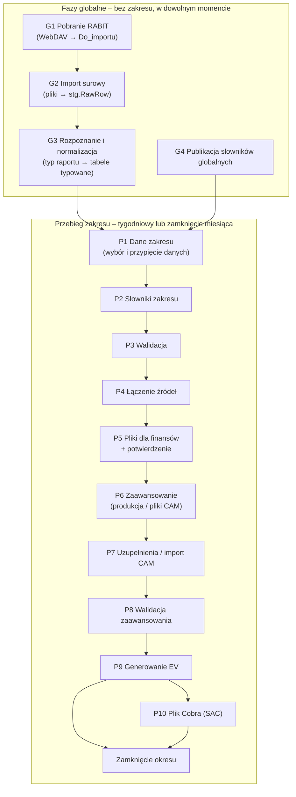

# AHD – Fazy pipeline (koncepcja)

Wersja: 0.1 (koncepcja do dyskusji)
Powiązane: `docs/architektura.md`, `docs/funkcjonalnosc.md`, `docs/mvp-etap1.md` (faza G1–G2 – działa).

---

## 1. Zasady wspólne dla wszystkich faz („kontrakt klocka”)

Każda faza jest osobnym klockiem o tym samym kształcie:

| Element | Znaczenie |
|---|---|
| **Wejście** | czyta **wyłącznie** dane utrwalone przez wcześniejsze fazy (tabele w bazie, zarejestrowane pliki, przypięte wersje słowników) – nigdy „z pamięci” poprzedniego kroku |
| **Bramka wejścia** | warunki, bez których faza nie ruszy (np. poprzednia faza zakończona, słownik ma zatwierdzoną wersję) |
| **Przetwarzanie** | logika biznesowa w bazie (procedury SQL); Python orkiestruje, czyta i zapisuje pliki |
| **Wyjście** | tabele w bazie + ewentualne pliki; każdy rekord ma identyfikator pochodzenia (import, przebieg, wersja) |
| **Bramka wyjścia** | kontrole, które muszą przejść, żeby następna faza mogła ruszyć |
| **Zapis stanu** | status fazy, kto, kiedy, **identyfikatory wejść** (hashe plików, wersje słowników, rewizje) – w `meta.EtapPrzebiegu` i dzienniku |
| **Idempotencja** | ponowne uruchomienie z tymi samymi wejściami daje ten sam wynik i nie dubluje danych |
| **Unieważnienie** | zmiana wejść fazy oznacza ją i wszystkie późniejsze jako **nieaktualne** |

Komunikacja między klockami odbywa się **przez bazę**: faza N zapisuje wynik i status, faza N+1 sprawdza
status i identyfikatory wejść. Dzięki temu fazy mogą być wykonywane przez różne osoby, w różne dni,
z różnych komputerów.

---

## 2. Mapa faz

| Faza | Zakres | Kto | Kiedy | Stan |
|---|---|---|---|---|
| G1 Pobranie RABIT | globalna | dowolna osoba z finansów | przed przebiegiem (np. poniedziałek rano) | **działa** |
| G2 Import surowy | globalna | j.w. | po G1 | **działa** |
| G3 Rozpoznanie i normalizacja | globalna | automatycznie po G2 | po G2 | koncepcja |
| G4 Słowniki globalne | globalna | właściciel słownika | przy zmianie | koncepcja |
| P1–P10 | zakres | osoba prowadząca zakres | tydzień / zamknięcie | prototyp |

---

## 3. Fazy globalne

### G1. Pobranie plików RABIT *(działa)*

| | |
|---|---|
| **Cel** | Mieć aktualną kopię wszystkich plików RABIT na dysku firmy. |
| **Wejście** | Folder RABIT na SharePoint (WebDAV, konto Windows). |
| **Jak pracuje** | Porównuje pliki źródłowe z `00_Global\RABIT\Do_importu` po rozmiarze i dacie; kopiuje tylko nowe i zmienione. |
| **Kontrole** | Dostępność WebDAV; limit 50 MB (plik > limitu → błąd z instrukcją pobrania ręcznego). |
| **Efekt** | Aktualne pliki w `Do_importu`. |
| **Przekazanie** | Folder `Do_importu` jest wejściem G2. Brak zapisu w bazie – G1 jest „transportem”. |
| **Ponowne uruchomienie** | Zawsze bezpieczne (kopiuje tylko różnice). |

### G2. Import surowy *(działa)*

| | |
|---|---|
| **Cel** | Zapisać w bazie każdą **nową treść** pliku – raz, niezależnie od nazwy i od tego, kto importuje. |
| **Wejście** | Pliki w `Do_importu`. |
| **Jak pracuje** | Pomija pliki o znanych metadanych; liczy SHA-256; znany hash = duplikat; nowy hash = kopia do Landing Zone + wiersze w postaci surowej. |
| **Kontrole** | Plik czytelny; części zestawu (`_cz1`, `_cz2`) mają te same kolumny. |
| **Efekt** | `meta.ImportBatch`, `meta.SourceFile` (hash, kolumny, **sygnatura kolumn**), `meta.SourceFileSeen`, `stg.RawRow`. |
| **Przekazanie** | Nowe rekordy `meta.SourceFile` ze statusem „do rozpoznania” są wejściem G3. |
| **Ponowne uruchomienie** | Idempotentne (hash). |

### G3. Rozpoznanie i normalizacja *(koncepcja)*

| | |
|---|---|
| **Cel** | Zamienić surowe wiersze na **dane typowane** o stałej strukturze (np. koszt: WBS CES, rodzaj kosztu, kwota, waluta, data księgowania, godziny, wydział) – niezależnie od nazwy pliku i układu kolumn. |
| **Wejście** | `meta.SourceFile` do rozpoznania + `stg.RawRow`; słownik **typów raportów** (sygnatura kolumn → typ raportu, mapowanie kolumn na pola standardowe, formaty dat i liczb). |
| **Jak pracuje** | Dopasowuje sygnaturę kolumn do słownika typów; dla znanego typu przekształca wiersze (typy danych, separator dziesiętny, daty, zera wiodące w WBS) do tabel typowanych, np. `stg.KosztCES`, `stg.ZobowiazaniaCES`. |
| **Kontrole** | Nieznana sygnatura → plik „nierozpoznany” (alert na pulpicie, wymaga dopisania typu do słownika). Błędy konwersji wierszy liczone i raportowane; próg błędów blokuje plik. Suma kontrolna: liczba wierszy i suma kwot przed/po. |
| **Efekt** | Tabele typowane z kolumną `Sha256` (pochodzenie) + status pliku „znormalizowany” / „nierozpoznany” / „błąd”. |
| **Przekazanie** | P1 czyta tylko pliki „znormalizowane”. Pliki nierozpoznane są widoczne w P1 jako ostrzeżenie „dane nieuwzględnione”. |
| **Ponowne uruchomienie** | Po zmianie słownika typów – ponowna normalizacja plików tego typu (nowa wersja słownika typów; przebiegi, które przypięły stare dane, dostają informację jak przy słownikach). |

### G4. Publikacja słowników globalnych *(koncepcja)*

| | |
|---|---|
| **Cel** | Udostępnić zatwierdzoną wersję słownika wspólnego (stawki wydziałów, kalendarz okresów, kursy USD/PLN, typy raportów). |
| **Wejście** | Plik Excel słownika w `00_Global\Slowniki`. |
| **Jak pracuje** | Kopia do Landing Zone + hash → walidacja (rozdz. 6 specyfikacji) → nowa wersja tylko przy zmianie treści. |
| **Kontrole** | Błąd blokujący odrzuca wersję; obowiązuje poprzednia. |
| **Efekt** | `dict.WersjaSlownika` + dane słownika z historią (SCD2). |
| **Przekazanie** | Przebieg przypina wersję w P1/P2; aktywne przebiegi ze starszą wersją dostają decyzję „kontynuuj / przelicz od P3”. |

---

## 4. Fazy przebiegu zakresu

Przebieg = jeden zakres × okres (tydzień albo zamknięcie miesiąca). Stan przebiegu jest w bazie,
fazy mogą być wykonywane w różne dni i przez różne osoby z finansów.

### P1. Dane zakresu

| | |
|---|---|
| **Cel** | Wybrać z danych globalnych **tylko to, co należy do zakresu i okresu**, i zamrozić ten wybór na czas przebiegu. |
| **Wejście** | Tabele typowane z G3; słownik „Struktura projektowa” zakresu (CAS WBS / P1S WBS); kalendarz okresów. |
| **Jak pracuje** | Filtruje wiersze po elementach WBS zakresu i datach okresu (koszt okresu i narastająco). **Przypina zestaw plików** (lista hashy) – analogicznie do przypinania wersji słowników. |
| **Kontrole** | Ostatni import G2 nie starszy niż X dni; brak plików nierozpoznanych z elementami zakresu (ostrzeżenie); daty w okresie. |
| **Efekt** | Snapshot danych zakresu `hist.DaneZakresu` (RunId, Sha256) + lista przypiętych plików. |
| **Przekazanie** | P2–P4 pracują wyłącznie na tym snapshocie. Nowy import w trakcie przebiegu → informacja „dostępne nowsze dane” i decyzja: kontynuuj / przelicz od P1. |

### P2. Słowniki zakresu

| | |
|---|---|
| **Cel** | Mieć aktualne, sprawdzone słowniki zakresu (struktura P1S↔CES, harmonogram i budżet, stawki CAS). |
| **Wejście** | Pliki słowników w `Zakresy\<Zakres>\Slowniki`; wersje słowników globalnych z G4. |
| **Jak pracuje** | Import słowników zakresu (hash bez zmian = brak nowej wersji; zmiana = kandydat); przypięcie wersji globalnych. |
| **Efekt** | Kandydaci nowych wersji + lista przypiętych wersji w przebiegu. |
| **Przekazanie** | Kandydaci trafiają do walidacji P3; nowa wersja powstaje dopiero po jej przejściu. |

### P3. Walidacja

| | |
|---|---|
| **Cel** | Nie dopuścić błędnych słowników i danych do obliczeń. |
| **Wejście** | Kandydaci słowników z P2; snapshot danych z P1. |
| **Jak pracuje** | Reguły deklaratywne per słownik (struktura, typy, klucze, okresy ważności, reguły biznesowe, odwołania między słownikami, wersjonowanie) + kontrole danych (np. wydział bez stawki). |
| **Kontrole** | Błąd blokujący → kandydat odrzucony, raport błędów obok pliku, obowiązuje poprzednia wersja. |
| **Efekt** | Zatwierdzone wersje słowników (przypięte) + lista ostrzeżeń. |
| **Przekazanie** | P4 startuje tylko bez błędów blokujących (albo po świadomej decyzji „kontynuuj na poprzedniej wersji”). |

### P4. Łączenie źródeł

| | |
|---|---|
| **Cel** | Zbudować jeden spójny obraz zakresu: koszt rzeczywisty (ACWP) przypisany do WP, CAM, kategorii kosztów, w walucie raportowej. |
| **Wejście** | Snapshot danych (P1), przypięte słowniki (P3), stawki i kursy. |
| **Jak pracuje** | Logika łączenia w bazie (**do przedstawienia przez zespół – O14**): mapowanie WBS CES → WP, przeliczenia stawek (CAS / SAP), przeliczenie godzin na koszt, waluta. |
| **Kontrole** | **Nowe elementy bez przypisania** (CES i P1S) – eksport propozycji do słownika; suma kontrolna (koszt po połączeniu = koszt ze snapshotu); tydzień: można pominąć z decyzją, zamknięcie: nie. |
| **Efekt** | `ev.KosztWP` (RunId, WP, okres, kwoty, pochodzenie) + raport pokrycia. |
| **Przekazanie** | P5 generuje z tego pliki dla finansów; P9 używa jako ACWP. |

### P5. Pliki dla finansów + potwierdzenie

| | |
|---|---|
| **Cel** | Dać finansom do sprawdzenia wynik łączenia, zanim zostanie użyty dalej (i wysłany do CAM). |
| **Wejście** | `ev.KosztWP`, raport pokrycia z P4. |
| **Jak pracuje** | Generuje pliki do `Zakresy\<Zakres>\Finanse\<RRRR-MM>\` (zawartość – O16); czeka na potwierdzenie w aplikacji. |
| **Kontrole** | Potwierdzenie (może je wykonać osoba prowadząca) albo odrzucenie z komentarzem. |
| **Efekt** | Pliki + zapis potwierdzenia (kto, kiedy). |
| **Przekazanie** | Potwierdzenie odblokowuje P6; odrzucenie cofa do P4 (P5+ nieaktualne). |

### P6–P8. Zaawansowanie

Dwa warianty, ten sam cel: **dla każdego WP wartość zaawansowania z zapisanym pochodzeniem**.

| | Tydzień | Zamknięcie miesiąca |
|---|---|---|
| **P6** | Pobranie zaawansowania z danych produkcyjnych P1S (np. `vAHDD`, źródło – O10) po P1S WBS ze słownika | Generowanie **pliku na CAM** (WP danego CAM z kolumny CAM słownika; ukryty identyfikator przebiegu; zablokowane komórki) do `CAM\…\Wyslane` |
| **P7** | Uzupełnienie braków przez analityka (metody – O11) | Import plików z `CAM\…\Zwrocone` (kontrola identyfikatora, okresu, zmian poza polami); status per CAM; może trwać dni |
| **P8** | Walidacja: 0–100%, spadki vs poprzedni okres, EV ≤ BAC; wartości spoza CAM dozwolone | Te same kontrole + **100% wartości od CAM** |
| **Efekt** | `ev.Zaawansowanie` (WP, okres, wartość, pochodzenie: PRODUKCJA / ANALITYK / CAM, kto, kiedy) | j.w., pochodzenie wyłącznie CAM |
| **Przekazanie** | P9 czyta `ev.Zaawansowanie` i status P8 | j.w. |

### P9. Generowanie EV

| | |
|---|---|
| **Cel** | Policzyć wskaźniki EV zakresu w sposób odtwarzalny. |
| **Wejście** | `ev.KosztWP` (ACWP), `ev.Zaawansowanie`, budżet i harmonogram (BAC, BCWS) z przypiętych słowników, ETC (źródło – O15). |
| **Jak pracuje** | Kalkulacja w bazie: BCWS, BCWP, ACWP, CPI, SPI, EAC, TCPI – na WP, CAM, projekt, zakres. |
| **Kontrole** | Spójność sum na poziomach; EV ≤ BAC. |
| **Efekt** | **Rewizja** wyników `ev.Wynik` (R1, R2…) z listą przypiętych wejść (hashe plików, wersje słowników, rewizja zaawansowania) + plik `EV\<RRRR-MM>\…`. |
| **Przekazanie** | Tydzień: EV wstępne (koniec przebiegu). Zamknięcie: P10 (SAC) i zatwierdzenie okresu. |

### P10. Plik dla Cobra (tylko SAC)

| | |
|---|---|
| **Cel** | Przekazać Sikorsky dane w formacie Cobra. |
| **Wejście** | Rewizja EV z P9, stawki bieżące, kurs USD. |
| **Efekt** | `EV\<RRRR-MM>\<Zakres>_<RRRR-MM>_Cobra_import.csv`. |

### Zamknięcie okresu

| | |
|---|---|
| **Cel** | Zamrozić formalny wynik miesiąca. |
| **Jak pracuje** | Zatwierdzenie w aplikacji; przebieg staje się tylko do odczytu. Ponowne przeliczenie = nowa rewizja w historii. |
| **Efekt** | Zamrożona rewizja EV – podstawa raportów i porównań kolejnych okresów. |

---

## 5. Co przepływa między fazami (podsumowanie)

| Z → Do | Nośnik | Identyfikator łączący |
|---|---|---|
| G1 → G2 | pliki w `Do_importu` | nazwa, rozmiar, data |
| G2 → G3 | `meta.SourceFile`, `stg.RawRow` | Sha256 |
| G3 → P1 | tabele typowane | Sha256 + typ raportu |
| G4 → P1/P2 | `dict.WersjaSlownika` | numer wersji |
| P1 → P2–P4 | `hist.DaneZakresu`, lista przypiętych plików | RunId + Sha256 |
| P2 → P3 | kandydaci wersji | RunId + hash pliku słownika |
| P3 → P4 | przypięte wersje słowników | RunId + wersje |
| P4 → P5, P9 | `ev.KosztWP` | RunId |
| P5 → P6 | potwierdzenie | RunId + status |
| P6/P7 → P8 → P9 | `ev.Zaawansowanie` | RunId + pochodzenie |
| P9 → P10, zamknięcie | `ev.Wynik` | RunId + rewizja |

---

## 6. Otwarte kwestie wynikające z koncepcji

| # | Kwestia |
|---|---|
| K1 | Słownik typów raportów dla plików RABIT (sygnatury kolumn i mapowanie na pola standardowe) – na podstawie pierwszych importów |
| K2 | Co zawierają poszczególne pliki RABIT (koszty, zobowiązania, „PZL roll”, „hedge”, „workaround”) i które fazy ich używają |
| K3 | Próg „świeżości” danych przed P1 (ile dni od ostatniego importu) |
| K4 | Koszt okresu vs narastająco – jak liczyć ACWP przy korektach wstecznych w SAP |
| O10, O11, O14–O17 | jak w `docs/architektura.md` / `docs/funkcjonalnosc.md` |
